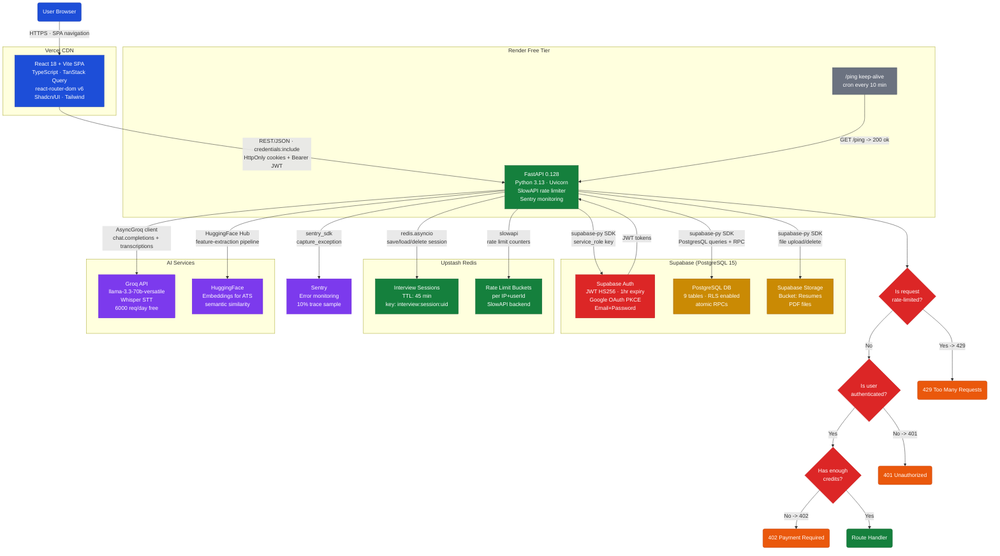

# Diagram 1: Master System Overview

[← Back to Master Index](../../ARCHITECTURE_FLOWCHARTS.md)

---

```mermaid
graph TD
    classDef frontend fill:#1d4ed8,color:#fff,stroke:#1e40af
    classDef backend fill:#15803d,color:#fff,stroke:#166534
    classDef db fill:#ca8a04,color:#fff,stroke:#a16207
    classDef auth fill:#dc2626,color:#fff,stroke:#b91c1c
    classDef error fill:#ea580c,color:#fff,stroke:#c2410c
    classDef external fill:#7c3aed,color:#fff,stroke:#6d28d9
    classDef config fill:#6b7280,color:#fff,stroke:#4b5563

    Browser(" User Browser")

    subgraph VERCEL[" Vercel CDN"]
        FE["React 18 + Vite SPA<br/>TypeScript · TanStack Query<br/>react-router-dom v6<br/>Shadcn/UI · Tailwind"]
    end

    subgraph RENDER[" Render Free Tier"]
        BE["FastAPI 0.128<br/>Python 3.13 · Uvicorn<br/>SlowAPI rate limiter<br/>Sentry monitoring"]
        PING["/ping keep-alive<br/>cron every 10 min"]
    end

    subgraph SUPABASE[" Supabase (PostgreSQL 15)"]
        AUTH["Supabase Auth<br/>JWT HS256 · 1hr expiry<br/>Google OAuth PKCE<br/>Email+Password"]
        DB["PostgreSQL DB<br/>9 tables · RLS enabled<br/>atomic RPCs"]
        STORE["Supabase Storage<br/>Bucket: Resumes<br/>PDF files"]
    end

    subgraph REDIS[" Upstash Redis"]
        SESS["Interview Sessions<br/>TTL: 45 min<br/>key: interview:session:uid"]
        RATELIM["Rate Limit Buckets<br/>per IP+userId<br/>SlowAPI backend"]
    end

    subgraph AI[" AI Services"]
        GROQ["Groq API<br/>llama-3.3-70b-versatile<br/>Whisper STT<br/>6000 req/day free"]
        HF["HuggingFace<br/>Embeddings for ATS<br/>semantic similarity"]
    end

    SENTRY["Sentry<br/>Error monitoring<br/>10% trace sample"]

    Browser -->|HTTPS · SPA navigation| FE
    FE -->|REST/JSON · credentials:include<br/>HttpOnly cookies + Bearer JWT| BE
    BE -->|supabase-py SDK<br/>service_role key| AUTH
    BE -->|supabase-py SDK<br/>PostgresQL queries + RPC| DB
    BE -->|supabase-py SDK<br/>file upload/delete| STORE
    BE -->|redis.asyncio<br/>save/load/delete session| SESS
    BE -->|slowapi<br/>rate limit counters| RATELIM
    BE -->|AsyncGroq client<br/>chat.completions + transcriptions| GROQ
    BE -->|HuggingFace Hub<br/>feature-extraction pipeline| HF
    BE -->|sentry_sdk<br/>capture_exception| SENTRY
    AUTH -->|JWT tokens| BE
    PING -->|GET /ping -> 200 ok| BE

    RateLimit{Is request<br/>rate-limited?}
    AuthCheck{Is user<br/>authenticated?}
    CreditCheck{Has enough<br/>credits?}

    BE --> RateLimit
    RateLimit -->|Yes -> 429| ERR429("429 Too Many Requests")
    RateLimit -->|No| AuthCheck
    AuthCheck -->|No -> 401| ERR401("401 Unauthorized")
    AuthCheck -->|Yes| CreditCheck
    CreditCheck -->|No -> 402| ERR402("402 Payment Required")
    CreditCheck -->|Yes| Handler("Route Handler")
    class Browser,FE frontend;
    class RATELIM,BE,Handler,SESS backend;
    class PING config;
    class CreditCheck,AUTH,RateLimit,AuthCheck auth;
    class STORE,DB db;
    class GROQ,HF,SENTRY external;
    class ERR402,ERR401,ERR429 error;
```
