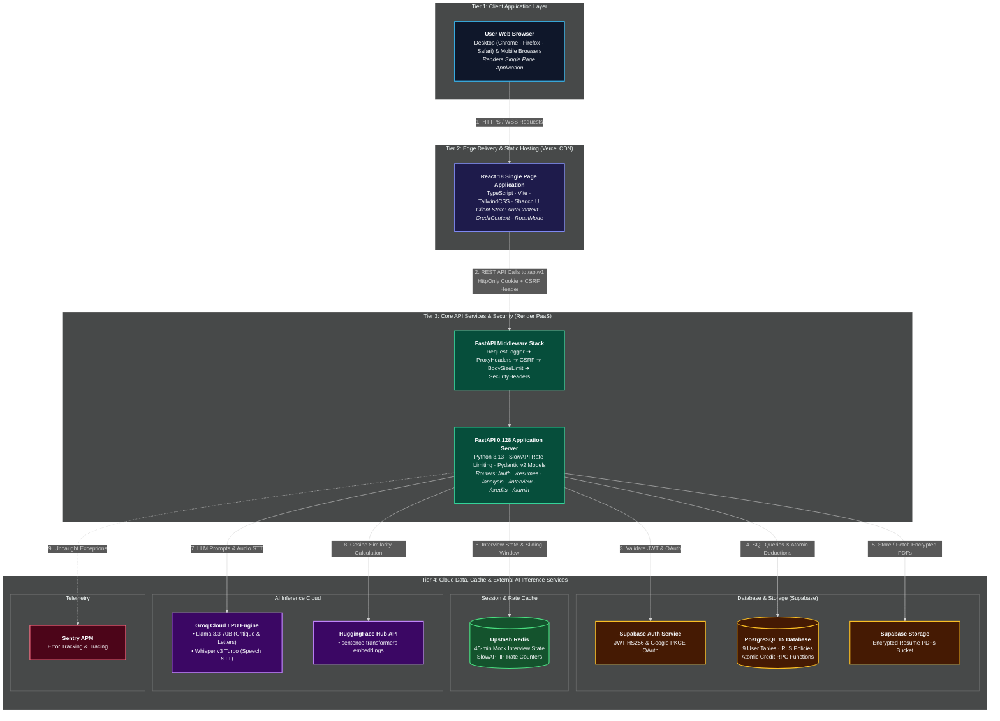

# Diagram 1: Master System Overview

[← Back to Architecture Hub](../README.md) · [← Documentation Hub](../../README.md)

---

## 🖥️ Visual System Topology (At a Glance)

```
┌─────────────────────────────────────────────────────────────────────────────┐
│                             1. USER BROWSER                                 │
│  • React 18 SPA (TypeScript + Vite)                                         │
│  • Manages AuthContext, CreditContext & RoastModeContext                    │
│  • Interacts via Fetch with HttpOnly Session Cookies + CSRF Header          │
└──────────────────────────────────────┬──────────────────────────────────────┘
                                       │ HTTPS
                                       ▼
┌─────────────────────────────────────────────────────────────────────────────┐
│                         2. EDGE CDN & PROXY LAYER                           │
│  • Vercel Edge CDN: Serves static assets, fonts, icons                     │
│  • Security: Strict-Transport-Security, nosniff, DENY, microphone=(self)   │
│  • API Proxy in Dev: Vite proxy /api -> http://localhost:8000               │
└──────────────────────────────────────┬──────────────────────────────────────┘
                                       │ REST / JSON
                                       ▼
┌─────────────────────────────────────────────────────────────────────────────┐
│                         3. FASTAPI BACKEND SERVICE                          │
│  ┌───────────────────────────────────────────────────────────────────────┐  │
│  │ Middlewares: Logger -> ProxyHeaders -> CSRF -> BodyLimit -> SecHeaders │  │
│  └───────────────────────────────────┬───────────────────────────────────┘  │
│                                      ▼                                       │
│  ┌───────────────────────────────────────────────────────────────────────┐  │
│  │ Route Pipeline: RateLimit (SlowAPI) -> Auth (JWT) -> Credit Guard     │  │
│  └───────────────────────────────────┬───────────────────────────────────┘  │
│                                      ▼                                       │
│  ┌───────────────────────────────────────────────────────────────────────┐  │
│  │ Service Logic: Prompt Sanitizer, ATS Scorer, Groq LLM, Whisper STT    │  │
│  └───────────────────────────────────┬───────────────────────────────────┘  │
└──────────────┬───────────────────────┼───────────────────────┬──────────────┘
               │                       │                       │
               ▼                       ▼                       ▼
┌───────────────────────────┐ ┌───────────────────┐ ┌─────────────────────────┐
│     SUPABASE PLATFORM     │ │   UPSTASH REDIS   │ │       AI ENGINES        │
│ • Auth: PKCE & JWT Verify │ │ • Session State   │ │ • Groq Cloud (Qwen)     │
│ • PostgreSQL 15 DB + RLS  │ │   (45-min TTL)    │ │ • Groq Whisper STT      │
│ • Atomic Credit RPCs      │ │ • Rate Limit      │ │ • HuggingFace MPNet     │
│ • Resumes Storage Bucket  │ │   Counters        │ │   Embeddings            │
└───────────────────────────┘ └───────────────────┘ └─────────────────────────┘
```

> 💡 **Quick Visual Preview:** In Antigravity IDE / VS Code, press **Ctrl + Shift + V** (or click the **Open Preview to the Side** icon at the top right of this editor) to view this flowchart rendered visually.
> 🌐 **Interactive Canvas Viewer:** You can also open [architecture_viewer.html](../architecture_viewer.html) directly in any web browser to pan, zoom, and inspect components.

---

## 📊 Technical Flowchart (Mermaid)



---

## 🔄 End-to-End Request Lifecycle

1. **Client Request:** The user interacts with the React frontend. State changes trigger an authenticated `fetch` with `credentials: "include"`, transmitting session cookies (`__krs_sid`, `__krs_rid`) and the `X-CSRF-Token` header.
2. **Middleware Execution:** FastAPI processes the request through:
   - `RequestLoggerMiddleware`: Generates a unique `X-Request-ID` and measures latency.
   - `CSRFMiddleware`: Validates the double-submit CSRF cookie against the incoming header.
   - `BodySizeLimitMiddleware`: Rejects request payloads exceeding 1MB (bypassed for `/resumes/upload` up to 5MB).
   - `SecurityHeadersMiddleware`: Sets strict CSP, HSTS, and `Permissions-Policy: camera=(), microphone=(self), geolocation=()`.
3. **Gateway Verification:**
   - **Rate Limiting:** SlowAPI increments Redis counters; returns HTTP 429 if the quota is exceeded.
   - **Authentication:** `get_current_user` extracts the JWT from the cookie, verifies signature against Supabase JWT secret, and loads the user model.
   - **Credit Verification:** For paid features, backend executes the atomic PostgreSQL RPC `deduct_credits()`. If balance is insufficient, returns HTTP 402.
4. **Service & AI Processing:**
   - Input is sanitized via `prompt_sanitizer.py` (stripping tags, unicode normalization, comment removal).
   - The appropriate engine executes (e.g. ATS math scorer, Groq LLM with exponential retry).
   - If an LLM call fails with 502, credits are atomically refunded via `refund_feature_credits()`.
5. **Response Delivery:** Result is persisted to PostgreSQL and returned to the client as JSON.
