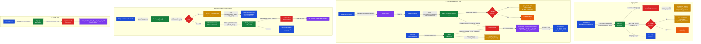

# Diagram 2: Authentication & Session Flow

[← Back to Master Index](../../ARCHITECTURE_FLOWCHARTS.md)

---

```mermaid
graph TD
    classDef frontend fill:#1d4ed8,color:#fff,stroke:#1e40af
    classDef backend fill:#15803d,color:#fff,stroke:#166534
    classDef db fill:#ca8a04,color:#fff,stroke:#a16207
    classDef auth fill:#dc2626,color:#fff,stroke:#b91c1c
    classDef error fill:#ea580c,color:#fff,stroke:#c2410c
    classDef external fill:#7c3aed,color:#fff,stroke:#6d28d9

    subgraph SIGNUP_FLOW["1. Sign Up Flow"]
        SignupForm["SignupForm<br/>useName+email+password<br/>client validation"]
        SignupHandler["sign_up()<br/>auth.py:47"]
        SupaAuth_SU["Supabase Auth<br/>creates auth.users row"]
        ProfileRow["profiles row created<br/>remaining_credits=0<br/>total_credits_granted=0"]
        IPCheck{IP already<br/>claimed?}
        GrantCredits["grant_credits RPC<br/>+100 credits<br/>ip_credit_claims insert"]
        NoGrant["0 credits granted<br/>anti-farming"]
        AutoLogin["auto-login<br/>apiLogin()"]

        SignupForm -->|"POST /api/v1/auth/signup<br/>{email,password,full_name}"| SignupHandler
        SignupHandler -->|"supabase.auth.sign_up()"| SupaAuth_SU
        SupaAuth_SU -->|"ON INSERT trigger<br/>handle_new_user()"| ProfileRow
        SignupHandler -->|"grant_initial_credits()<br/>credits.py:84"| IPCheck
        IPCheck -->|No| GrantCredits
        IPCheck -->|Yes| NoGrant
        SignupHandler -->|"200 {msg,user_id}"| AutoLogin
    end

    subgraph LOGIN_FLOW["2. Login & Google OAuth Flow"]
        LoginForm["LoginForm<br/>email+password"]
        LoginHandler["login()<br/>auth.py:83"]
        GoogleBtn["Google Sign-In Button"]
        GoogleOAuth["Google OAuth<br/>redirect to /auth/callback"]
        AuthCallback["AuthCallback.tsx<br/>exchangeWithRetry()"]
        OAuthHandler["oauth_exchange_session()<br/>auth.py:136"]
        SupaAuth_LI["Supabase Auth<br/>verifies credentials"]
        SetCookies_LI["set_session_cookies_and_cleanup()<br/>HttpOnly __krs_sid + __krs_rid<br/>JS-readable __krs_xsrf cookie"]
        StoreTokens_LI["localStorage:<br/>__krs_access_token<br/>__krs_refresh_token"]
        UpdateProfile["UPDATE profiles<br/>last_sign_in_at=now()"]
        IPCheck_OA{IP already<br/>claimed?}
        GrantCredits_OA["grant_credits RPC<br/>+100 credits<br/>ip_credit_claims insert"]
        NoGrant_OA["0 credits granted<br/>anti-farming"]

        LoginForm -->|"POST /api/v1/auth/login"| LoginHandler
        LoginHandler -->|"supabase.auth.sign_in_with_password()"| SupaAuth_LI
        
        GoogleBtn -->|"supabase.auth.signInWithOAuth()<br/>PKCE flow"| GoogleOAuth
        GoogleOAuth -->|"?code=xxx"| AuthCallback
        AuthCallback -->|"POST /api/v1/auth/oauth/session<br/>{code, code_verifier}"| OAuthHandler
        OAuthHandler -->|"anon.auth.exchange_code_for_session()"| SupaAuth_LI
        OAuthHandler -->|"grant_initial_credits()"| IPCheck_OA
        
        IPCheck_OA -->|No| GrantCredits_OA
        IPCheck_OA -->|Yes| NoGrant_OA
        
        SupaAuth_LI -->|"JWT access+refresh"| SetCookies_LI
        SetCookies_LI -->|"Access: 4 days<br/>Refresh: 30 days"| StoreTokens_LI
        LoginHandler -->|"200 {csrf_token, access_token}"| UpdateProfile
    end

    subgraph SESSION_FLOW["3. Session Check & Token Refresh"]
        PageLoad["Page Load / useAuth mount"]
        MeHandler["get_current_user_profile()<br/>auth.py:265"]
        TokenVerify{Token<br/>valid?}
        RefreshFlow["tryRefreshSession()<br/>POST /auth/refresh"]
        FetchProfile["SELECT * FROM profiles<br/>grant_daily_credits()"]
        CreditRefresh["CreditContext.fetchAll()<br/>GET /credits/balance<br/>GET /credits/costs"]
        RefreshHandler["refresh_session()<br/>auth.py:216"]
        SupaAuth_REF["Supabase Auth<br/>refresh session"]
        SetCookies_REF["set_session_cookies_and_cleanup()"]
        Logout_REF["clearStoredTokens()<br/>clearCsrfToken()<br/>user=null"]

        PageLoad -->|"GET /api/v1/auth/me<br/>Bearer JWT header"| MeHandler
        MeHandler -->|"get_current_user()<br/>dependencies.py:19"| TokenVerify
        TokenVerify -->|No -> 401| RefreshFlow
        TokenVerify -->|Yes| FetchProfile
        FetchProfile -->|"200 {id,email,profile,is_admin<br/>daily_grant}"| CreditRefresh

        RefreshFlow -->|"POST /api/v1/auth/refresh<br/>{refresh_token}"| RefreshHandler
        RefreshHandler -->|"supabase.auth.refresh_session()"| SupaAuth_REF
        SupaAuth_REF -->|"New JWT pair"| SetCookies_REF
        RefreshHandler -->|"Fail -> 401"| Logout_REF
    end

    subgraph LOGOUT_FLOW["4. Logout Flow"]
        LogoutBtn["Logout button"]
        LogoutHandler["logout()<br/>auth.py:252"]
        SupaAuth_LO["Supabase Auth<br/>sign_out()"]
        ClearCookies["delete_cookie(__krs_sid,__krs_rid,__krs_xsrf)<br/>Cookies cleared"]

        LogoutBtn -->|"POST /api/v1/auth/logout"| LogoutHandler
        LogoutHandler -->|"supabase.auth.sign_out()"| SupaAuth_LO
        SupaAuth_LO --> ClearCookies
    end

    class SignupForm,LoginForm,GoogleBtn,AuthCallback,PageLoad,LogoutBtn,AutoLogin,StoreTokens_LI,Logout_REF,CreditRefresh frontend;
    class SignupHandler,LoginHandler,OAuthHandler,MeHandler,RefreshHandler,LogoutHandler,RefreshFlow backend;
    class SupaAuth_SU,SupaAuth_LI,SupaAuth_REF,SupaAuth_LO,IPCheck,IPCheck_OA,TokenVerify auth;
    class ProfileRow,GrantCredits,GrantCredits_OA,UpdateProfile,FetchProfile db;
    class NoGrant,NoGrant_OA error;
    class GoogleOAuth,SetCookies_LI,SetCookies_REF,ClearCookies external;
```
