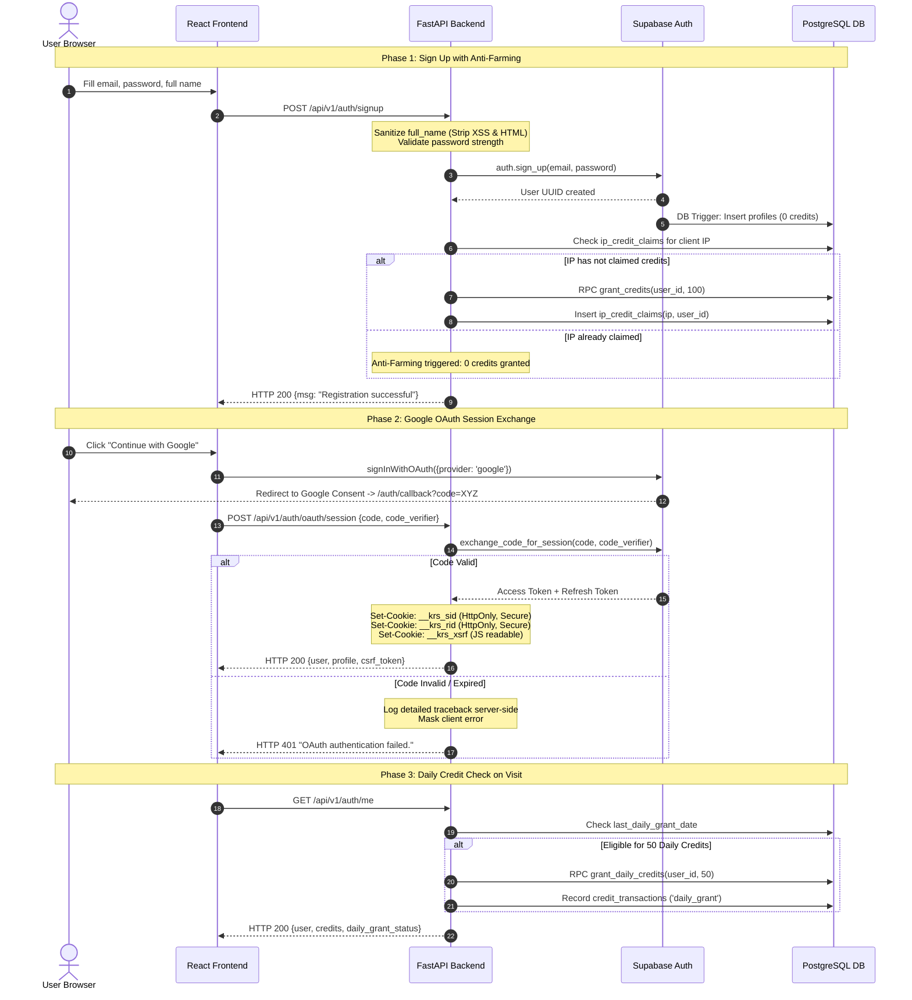

# Diagram 2: Authentication & Session Flow

[← Back to Architecture Hub](../README.md) · [← Documentation Hub](../../README.md)

---

> 💡 **Quick Visual Preview:** In Antigravity IDE / VS Code, press **Ctrl + Shift + V** (or click the **Open Preview to the Side** icon at top-right) to view this flowchart rendered visually.
> 🌐 **Interactive Canvas Viewer:** You can also open [architecture_viewer.html](../architecture_viewer.html) directly in any web browser to pan, zoom, and inspect components.

---


## 🔐 Auth & Session Lifecycle (At a Glance)

```
┌─────────────────────────────────────────────────────────────────────────────┐
│                              1. SIGNUP FLOW                                 │
│  User Input (Email, Password, Name)                                         │
│       │                                                                     │
│       ▼                                                                     │
│  POST /api/v1/auth/signup                                                   │
│       ├─► Pydantic Validation & Stored XSS Sanitization (HTML tags stripped)│
│       ├─► Supabase Auth: creates auth.users record                          │
│       ├─► DB Trigger: handle_new_user() creates profiles record             │
│       └─► Anti-Farming: Check IP in ip_credit_claims -> Grant 100 credits   │
└─────────────────────────────────────────────────────────────────────────────┘

┌─────────────────────────────────────────────────────────────────────────────┐
│                            2. LOGIN / OAUTH FLOW                            │
│  Option A: Email/Password           Option B: Google OAuth (PKCE)           │
│       │                                  │                                  │
│       ▼                                  ▼                                  │
│  POST /api/v1/auth/login            POST /api/v1/auth/oauth/session         │
│  Supabase password verify           Exchange code + code_verifier           │
│       │                                  │                                  │
│       └──────────────────┬───────────────┘                                  │
│                          ▼                                                  │
│              Session Cookie Dispatch                                        │
│              • Set HttpOnly __krs_sid (Access Token, 1h)                    │
│              • Set HttpOnly __krs_rid (Refresh Token, 30d)                  │
│              • Set JS-readable __krs_xsrf (CSRF double-submit token)        │
│              • Return user profile + credit balance                         │
└─────────────────────────────────────────────────────────────────────────────┘

┌─────────────────────────────────────────────────────────────────────────────┐
│                         3. AUTHENTICATED REQUESTS                           │
│  Client sends credentials: "include" + X-CSRF-Token header                  │
│       │                                                                     │
│       ▼                                                                     │
│  FastAPI Security Pipeline:                                                 │
│  1. CSRFMiddleware checks header matches __krs_xsrf cookie                  │
│  2. get_current_user reads __krs_sid cookie and verifies JWT                │
│  3. If token expired, client calls POST /api/v1/auth/refresh                │
└─────────────────────────────────────────────────────────────────────────────┘
```

---

## 📊 Technical Flowchart (Mermaid)



---

## 🛡️ Security Mechanisms

| Mechanism | Implementation Details |
|---|---|
| **Stored XSS Prevention** | `UserAuth.full_name` stripped of HTML tags (`<[^>]+>`) and special characters (`[<>"\'&;]`), capped at 100 chars. |
| **HttpOnly Cookie Tokens** | JWT access (`__krs_sid`) and refresh (`__krs_rid`) tokens are stored in HttpOnly cookies, immune to JavaScript theft. |
| **CSRF Protection** | Double-submit pattern: backend sets JS-readable `__krs_xsrf` cookie. Frontend sends matching `X-CSRF-Token` header. |
| **Exception Masking** | Supabase internal errors in OAuth exchange are sanitized to generic client messages while logged server-side. |
| **Anti-Farming Protection** | `ip_credit_claims` enforces one initial 100-credit bonus per unique IP address. |
