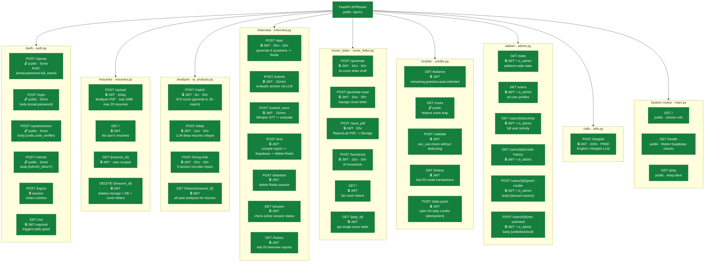

# Diagram 3: Complete API Route Map

[← Back to Master Index](../../ARCHITECTURE_FLOWCHARTS.md)

---

```mermaid
graph TD
    classDef frontend fill:#1d4ed8,color:#fff,stroke:#1e40af
    classDef backend fill:#15803d,color:#fff,stroke:#166534
    classDef db fill:#ca8a04,color:#fff,stroke:#a16207
    classDef auth fill:#dc2626,color:#fff,stroke:#b91c1c
    classDef error fill:#ea580c,color:#fff,stroke:#c2410c

    APIRouter["FastAPI APIRouter<br/>prefix: /api/v1"]

    subgraph AUTH_ROUTES["/auth - auth.py"]
        A1["POST /signup<br/>🔓 public · 5/min<br/>body:{email,password,full_name}"]
        A2["POST /login<br/>🔓 public · 5/min<br/>body:{email,password}"]
        A3["POST /oauth/session<br/>🔓 public · 5/min<br/>body:{code,code_verifier}"]
        A4["POST /refresh<br/>🔓 public · 5/min<br/>body:{refresh_token?}"]
        A5["POST /logout<br/>🔒 session<br/>clears cookies"]
        A6["GET /me<br/>🔒 JWT required<br/>triggers daily grant"]
    end

    subgraph RESUME_ROUTES["/resumes - resumes.py"]
        R1["POST /upload<br/>🔒 JWT · 5/day<br/>Multipart PDF · max 5MB · max 20 resumes"]
        R2["GET /<br/>🔒 JWT<br/>list user's resumes"]
        R3["GET /{resume_id}<br/>🔒 JWT · user-scoped"]
        R4["DELETE /{resume_id}<br/>🔒 JWT<br/>deletes storage + DB + cover letters"]
    end

    subgraph ANALYSIS_ROUTES["/analysis - ai_analysis.py"]
        AN1["POST /match<br/>🔒 JWT · 5cr · 5/hr<br/>ATS score (general or JD-match)"]
        AN2["POST /deep<br/>🔒 JWT · 15cr · 5/hr<br/>LLM deep resume critique"]
        AN3["POST /hiring-intel<br/>🔒 JWT · 25cr · 5/hr<br/>9-section recruiter report"]
        AN4["GET /history/{resume_id}<br/>🔒 JWT<br/>all past analyses for resume"]
    end

    subgraph INTERVIEW_ROUTES["/interview - interview.py"]
        I1["POST /start<br/>🔒 JWT · 25cr · 5/hr<br/>generate 6 questions -> Redis"]
        I2["POST /submit<br/>🔒 JWT · 15/min<br/>evaluate answer via LLM"]
        I3["POST /submit_voice<br/>🔒 JWT · 15/min<br/>Whisper STT -> evaluate"]
        I4["POST /end<br/>🔒 JWT<br/>compile report -> Supabase -> delete Redis"]
        I5["POST /abandon<br/>🔒 JWT<br/>delete Redis session"]
        I6["GET /session<br/>🔒 JWT<br/>check active session status"]
        I7["GET /history<br/>🔒 JWT<br/>last 20 interview reports"]
    end

    subgraph COVER_ROUTES["/cover_letter - cover_letter.py"]
        C1["POST /generate<br/>🔒 JWT · 10cr · 5/hr<br/>AI cover letter draft"]
        C2["POST /generate-roast<br/>🔒 JWT · 10cr · 5/hr<br/>Savage cover letter"]
        C3["POST /save_pdf<br/>🔒 JWT · 5/hr<br/>ReportLab PDF -> Storage"]
        C4["POST /humanize<br/>🔒 JWT · 15cr · 5/hr<br/>AI humanizer"]
        C5["GET /<br/>🔒 JWT<br/>list cover letters"]
        C6["GET /{app_id}<br/>🔒 JWT<br/>get single cover letter"]
    end

    subgraph CREDIT_ROUTES["/credits - credits.py"]
        CR1["GET /balance<br/>🔒 JWT<br/>remaining,granted,used,unlimited"]
        CR2["GET /costs<br/>🔓 public<br/>feature costs map"]
        CR3["POST /validate<br/>🔒 JWT<br/>can_use check without deducting"]
        CR4["GET /history<br/>🔒 JWT<br/>last 50 credit transactions"]
        CR5["POST /daily-grant<br/>🔒 JWT<br/>claim 50 daily credits (idempotent)"]
    end

    subgraph ADMIN_ROUTES["/admin - admin.py"]
        AD1["GET /stats<br/>🔒 JWT + is_admin<br/>platform-wide stats"]
        AD2["GET /users<br/>🔒 JWT + is_admin<br/>all user profiles"]
        AD3["GET /users/{id}/activity<br/>🔒 JWT + is_admin<br/>full user activity"]
        AD4["GET /users/{id}/credit-history<br/>🔒 JWT + is_admin"]
        AD5["POST /users/{id}/grant-credits<br/>🔒 JWT + is_admin<br/>body:{amount,reason}"]
        AD6["POST /users/{id}/set-unlimited<br/>🔒 JWT + is_admin<br/>body:{unlimited:bool}"]
    end

    subgraph UTIL_ROUTES["/utils - utils.py"]
        U1["POST /hinglish<br/>🔒 JWT · 20/hr · FREE<br/>English->Hinglish LLM"]
    end

    subgraph SYSTEM_ROUTES["System routes - main.py"]
        S1["GET /<br/>public · version info"]
        S2["GET /health<br/>public · Redis+Supabase checks"]
        S3["GET /ping<br/>public · keep-alive"]
    end

    APIRouter --> AUTH_ROUTES
    APIRouter --> RESUME_ROUTES
    APIRouter --> ANALYSIS_ROUTES
    APIRouter --> INTERVIEW_ROUTES
    APIRouter --> COVER_ROUTES
    APIRouter --> CREDIT_ROUTES
    APIRouter --> ADMIN_ROUTES
    APIRouter --> UTIL_ROUTES
    APIRouter --> SYSTEM_ROUTES
    class AD6,A6,CR5,A2,I3,I2,C2,R1,AD3,I4,CR1,I1,I5,C6,AN4,CR3,S2,R4,A4,C3,C1,AN3,C4,S1,S3,APIRouter,AD2,A5,A3,CR4,AN1,AD4,AD5,AN2,A1,I7,C5,AD1,R3,I6,R2,U1,CR2 backend;
```
