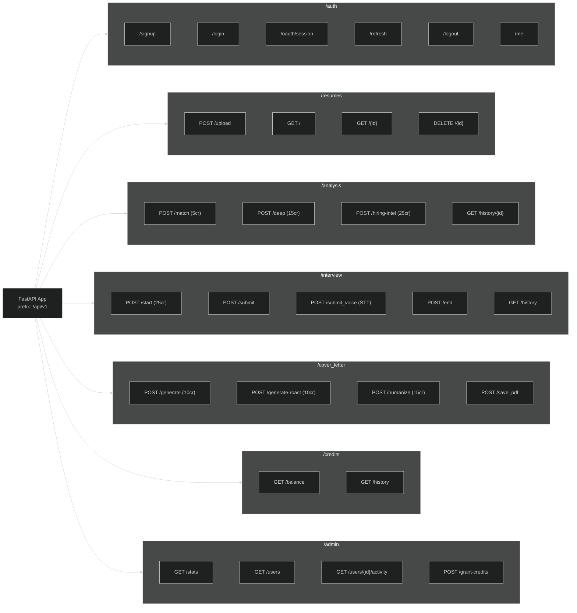

# Diagram 3: Complete API Route Map

[← Back to Architecture Hub](../README.md) · [← Documentation Hub](../../README.md)

---

> 💡 **Quick Visual Preview:** In Antigravity IDE / VS Code, press **Ctrl + Shift + V** (or click the **Open Preview to the Side** icon at top-right) to view this flowchart rendered visually.
> 🌐 **Interactive Canvas Viewer:** You can also open [architecture_viewer.html](../architecture_viewer.html) directly in any web browser to pan, zoom, and inspect components.

---


## 🗺️ Visual Route Inventory (At a Glance)

```
/api/v1 (FastAPI Route Tree)
├── /auth
│   ├── POST /signup             (Public · 5/min · User registration + anti-farming)
│   ├── POST /login              (Public · 5/min · Password authentication)
│   ├── POST /oauth/session      (Public · 5/min · Google PKCE token exchange)
│   ├── POST /refresh            (Public · 5/min · Cookie refresh)
│   ├── POST /logout             (Session · Clear HttpOnly cookies)
│   └── GET  /me                 (JWT Required · Profile + Daily 50 credits grant)
├── /resumes
│   ├── POST /upload             (JWT Required · 5/day · Max 5MB PDF · Magic byte validation)
│   ├── GET  /                   (JWT Required · List user resumes)
│   ├── GET  /{resume_id}        (JWT Required · Get resume parsed content & feedback)
│   └── DELETE /{resume_id}      (JWT Required · Cascade deletes storage + analyses + letters)
├── /analysis
│   ├── POST /match              (JWT Required · 5 credits · 5/hr · ATS match score)
│   ├── POST /deep               (JWT Required · 15 credits · 5/hr · LLM deep critique + 502 refund)
│   ├── POST /hiring-intel       (JWT Required · 25 credits · 5/hr · 9-section recruiter report + 502 refund)
│   └── GET  /history/{resume_id}(JWT Required · Isolated by user_id)
├── /interview
│   ├── POST /start              (JWT Required · 25 credits · 5/hr · Generates 6 Qs -> Redis)
│   ├── POST /submit             (JWT Required · 15/min · Evaluates single answer)
│   ├── POST /submit_voice       (JWT Required · 15/min · Max 10MB audio · Whisper STT)
│   ├── POST /end                (JWT Required · Compiles final report -> PostgreSQL)
│   ├── POST /abandon            (JWT Required · Clears active Redis session)
│   ├── GET  /session            (JWT Required · Checks current question index)
│   └── GET  /history            (JWT Required · Last 20 interview reports)
├── /cover_letter
│   ├── POST /generate           (JWT Required · 10 credits · 5/hr · Role-targeted draft)
│   ├── POST /generate-roast     (JWT Required · 10 credits · 5/hr · Savage roast critique)
│   ├── POST /humanize           (JWT Required · 15 credits · 5/hr · 50-5000 chars · Strips AI tone)
│   ├── POST /save_pdf           (JWT Required · 5/hr · ReportLab PDF export)
│   ├── GET  /                   (JWT Required · List user cover letters)
│   └── GET  /{app_id}           (JWT Required · Fetch single cover letter)
├── /credits
│   ├── GET  /balance            (JWT Required · Remaining, granted, used, unlimited flag)
│   └── GET  /history            (JWT Required · Last 50 transactions with pagination)
├── /admin
│   ├── GET  /stats              (Admin Only · Global users, resumes, credit totals)
│   ├── GET  /users              (Admin Only · Searchable user list)
│   ├── GET  /users/{id}/activity(Admin Only · Multi-tab user activity inspection)
│   └── POST /users/{id}/grant-credits (Admin Only · Add/deduct credits)
└── /health & /ping              (Public · System health checks · Not rate-limited)
```

---

## 📊 Technical Flowchart (Mermaid)



---

## 🔒 Endpoint Security & Rate Limit Matrix

| Route | Method | Auth Required | Rate Limit | Credit Cost | Key Validations |
|---|---|---|---|---|---|
| `/auth/signup` | POST | ❌ Public | 5 / min | Free | Password strength, full_name XSS sanitization |
| `/auth/login` | POST | ❌ Public | 5 / min | Free | Email validation |
| `/auth/oauth/session`| POST | ❌ Public | 5 / min | Free | PKCE code exchange, masked errors |
| `/auth/me` | GET | ✅ JWT | 60 / min | Free | Checks and grants daily 50 credits |
| `/resumes/upload` | POST | ✅ JWT | 5 / day | Free | PDF magic bytes (`%PDF-`), max 5MB, max 20 files |
| `/analysis/match` | POST | ✅ JWT | 5 / hr | 5 credits | TF-IDF / HuggingFace embedding fallback |
| `/analysis/deep` | POST | ✅ JWT | 5 / hr | 15 credits | Prompt sanitization, refund on 502 |
| `/analysis/hiring-intel`| POST | ✅ JWT | 5 / hr | 25 credits | Prompt sanitization, refund on 502 |
| `/interview/start` | POST | ✅ JWT | 5 / hr | 25 credits | 6 questions generated, 45-min TTL in Redis |
| `/interview/submit_voice`| POST | ✅ JWT | 15 / min | Free in session | MIME check (`audio/*`), max 10MB, Whisper STT |
| `/cover_letter/humanize`| POST | ✅ JWT | 5 / hr | 15 credits | Length bounds: 50 to 5,000 characters |
| `/admin/*` | ANY | 🛡️ Admin Only| 30 / min | Free | `is_admin = true` required |
