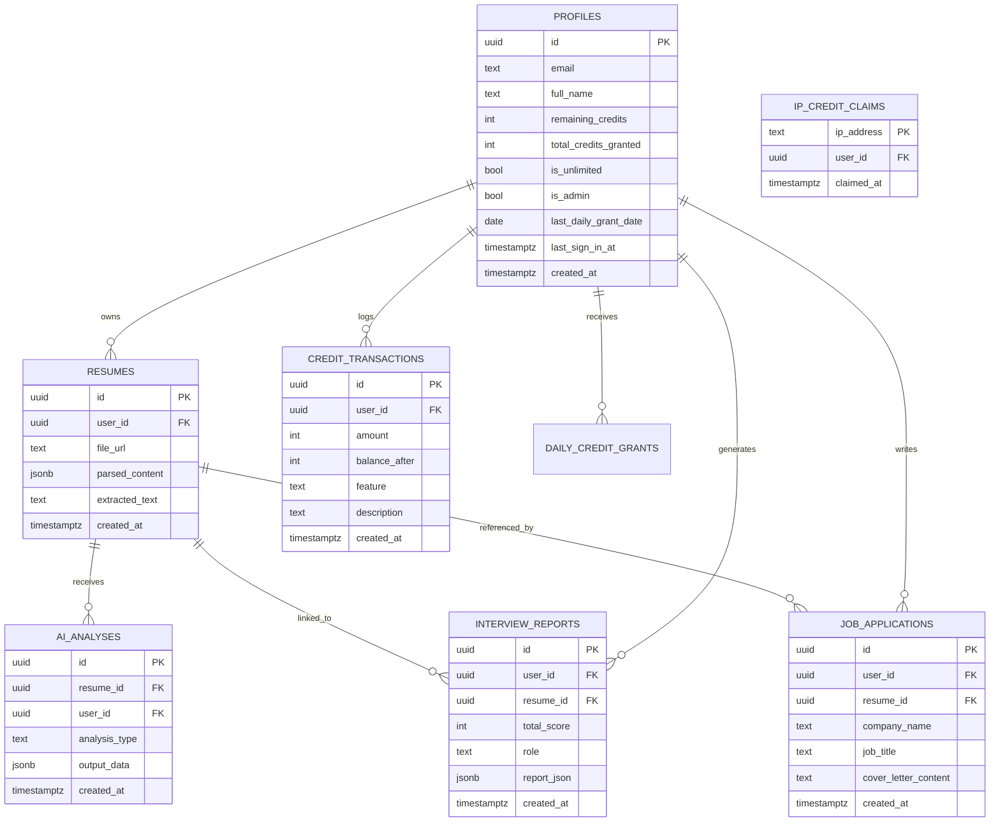

# Diagram 4: Database Schema & Entity Relationships

[← Back to Architecture Hub](../README.md) · [← Documentation Hub](../../README.md)

---

## 🗄️ Relational Database Model (At a Glance)

```
       ┌───────────────────────────────┐
       │          AUTH.USERS           │
       │  (Managed by Supabase Auth)   │
       └──────────────┬────────────────┘
                      │ 1:1 (Trigger: handle_new_user)
                      ▼
       ┌───────────────────────────────┐
       │           PROFILES            │
       │  id (PK, UUID = auth.users)   │
       │  email, full_name, credits    │
       │  is_unlimited, is_admin       │
       └──────┬───────────────┬────────┘
              │ 1:N           │ 1:N
              ▼               ▼
┌────────────────────────┐  ┌─────────────────────────┐
│        RESUMES         │  │   CREDIT_TRANSACTIONS   │
│ id (PK), user_id (FK)  │  │ id (PK), user_id (FK)   │
│ file_url, text_content │  │ amount, balance_after   │
│ parsed_content (JSONB) │  │ feature, reason         │
└──────┬──────────────┬──┘  └─────────────────────────┘
       │ 1:N          │ 1:N
       ▼              ▼
┌──────────────┐  ┌────────────────────────┐
│ AI_ANALYSES  │  │    JOB_APPLICATIONS    │
│ id (PK)      │  │ id (PK), user_id (FK)  │
│ resume_id(FK)│  │ resume_id (FK)         │
│ user_id (FK) │  │ company, title, JD     │
│ output(JSONB)│  │ cover_letter_content   │
└──────────────┘  └────────────────────────┘
       ▲
       │ 1:N (Optional Link)
┌──────┴───────────────┐  ┌───────────────────────────┐
│  INTERVIEW_REPORTS   │  │    DAILY_CREDIT_GRANTS    │
│ id (PK), user_id(FK) │  │ id (PK), user_id (FK)     │
│ resume_id (FK, Null) │  │ grant_date, amount        │
│ total_score, report  │  │ (Unique user_id + date)   │
└──────────────────────┘  └───────────────────────────┘
```

---

## 📊 Technical ER Diagram (Mermaid)



---

## ⚡ Stored Procedures & Atomic PostgreSQL RPCs

| RPC Function | Parameters | Description & Security |
|---|---|---|
| `deduct_credits()` | `p_user_id, p_feature, p_cost` | Atomically checks `remaining_credits >= p_cost`, deducts credits, inserts audit record into `credit_transactions`, returns new balance. Bypassed if `is_unlimited = true`. |
| `refund_feature_credits()` | `p_user_id, p_feature, p_cost, p_reason` | Atomically restores credits on 502/LLM failure, records `feature = "ai_failure_refund"` in `credit_transactions`. |
| `grant_daily_credits()` | `p_user_id, p_amount` | Checks if `last_daily_grant_date < CURRENT_DATE`. Adds 50 credits, updates date, records grant in `daily_credit_grants`. |
| `get_admin_credit_stats()` | None | Admin-only RPC returning total system credits granted, total consumed, active users, and system liability. |
