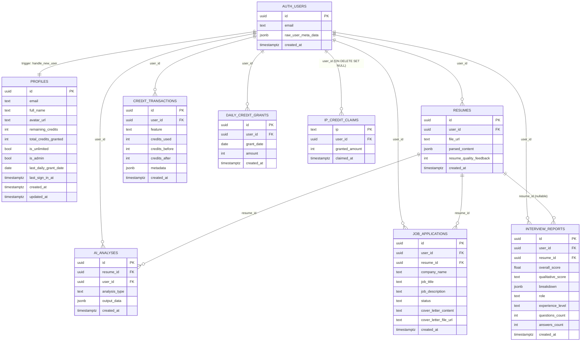

# Diagram 4: Database Schema & Data Flow

[← Back to Master Index](../../ARCHITECTURE_FLOWCHARTS.md)

---

```mermaid
erDiagram
    AUTH_USERS {
        uuid id PK
        text email
        jsonb raw_user_meta_data
        timestamptz created_at
    }

    PROFILES {
        uuid id PK
        text email
        text full_name
        text avatar_url
        int remaining_credits
        int total_credits_granted
        bool is_unlimited
        bool is_admin
        date last_daily_grant_date
        timestamptz last_sign_in_at
        timestamptz created_at
        timestamptz updated_at
    }

    RESUMES {
        uuid id PK
        uuid user_id FK
        text file_url
        jsonb parsed_content
        int resume_quality_feedback
        timestamptz created_at
    }

    AI_ANALYSES {
        uuid id PK
        uuid resume_id FK
        uuid user_id FK
        text analysis_type
        jsonb output_data
        timestamptz created_at
    }

    JOB_APPLICATIONS {
        uuid id PK
        uuid user_id FK
        uuid resume_id FK
        text company_name
        text job_title
        text job_description
        text status
        text cover_letter_content
        text cover_letter_file_url
        timestamptz created_at
    }

    INTERVIEW_REPORTS {
        uuid id PK
        uuid user_id FK
        uuid resume_id FK
        float overall_score
        text qualitative_score
        jsonb breakdown
        text role
        text experience_level
        int questions_count
        int answers_count
        timestamptz created_at
    }

    CREDIT_TRANSACTIONS {
        uuid id PK
        uuid user_id FK
        text feature
        int credits_used
        int credits_before
        int credits_after
        jsonb metadata
        timestamptz created_at
    }

    DAILY_CREDIT_GRANTS {
        uuid id PK
        uuid user_id FK
        date grant_date
        int amount
        timestamptz created_at
    }

    IP_CREDIT_CLAIMS {
        text ip PK
        uuid user_id FK
        int granted_amount
        timestamptz claimed_at
    }

    AUTH_USERS ||--|| PROFILES : "trigger: handle_new_user"
    AUTH_USERS ||--o{ RESUMES : "user_id"
    AUTH_USERS ||--o{ AI_ANALYSES : "user_id"
    AUTH_USERS ||--o{ JOB_APPLICATIONS : "user_id"
    AUTH_USERS ||--o{ INTERVIEW_REPORTS : "user_id"
    AUTH_USERS ||--o{ CREDIT_TRANSACTIONS : "user_id"
    AUTH_USERS ||--o{ DAILY_CREDIT_GRANTS : "user_id"
    AUTH_USERS ||--o{ IP_CREDIT_CLAIMS : "user_id (ON DELETE SET NULL)"
    RESUMES ||--o{ AI_ANALYSES : "resume_id"
    RESUMES ||--o{ JOB_APPLICATIONS : "resume_id"
    RESUMES ||--o{ INTERVIEW_REPORTS : "resume_id (nullable)"
```
