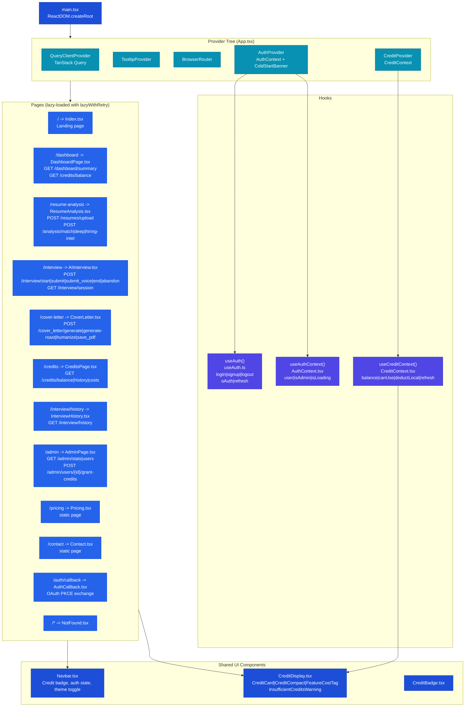

# Diagram 5: Frontend Architecture & Component Tree

[← Back to Master Index](../../ARCHITECTURE_FLOWCHARTS.md)

---

```mermaid
graph TD
    classDef frontend fill:#1d4ed8,color:#fff,stroke:#1e40af
    classDef context fill:#0891b2,color:#fff,stroke:#0e7490
    classDef page fill:#2563eb,color:#fff,stroke:#1d4ed8
    classDef hook fill:#4f46e5,color:#fff,stroke:#4338ca

    Main["main.tsx<br/>ReactDOM.createRoot"]

    subgraph PROVIDERS["Provider Tree (App.tsx)"]
        QCP["QueryClientProvider<br/>TanStack Query"]
        TTP["TooltipProvider"]
        BRP["BrowserRouter"]
        AP["AuthProvider<br/>AuthContext + ColdStartBanner"]
        CP["CreditProvider<br/>CreditContext"]
    end

    subgraph PAGES["Pages (lazy-loaded with lazyWithRetry)"]
        PG1["/ -> Index.tsx<br/>Landing page"]
        PG2["/dashboard -> DashboardPage.tsx<br/>GET /dashboard/summary<br/>GET /credits/balance"]
        PG3["/resume-analysis -> ResumeAnalysis.tsx<br/>POST /resumes/upload<br/>POST /analysis/match|deep|hiring-intel"]
        PG4["/interview -> AIInterview.tsx<br/>POST /interview/start|submit|submit_voice|end|abandon<br/>GET /interview/session"]
        PG5["/cover-letter -> CoverLetter.tsx<br/>POST /cover_letter/generate|generate-roast|humanize|save_pdf"]
        PG6["/credits -> CreditsPage.tsx<br/>GET /credits/balance|history|costs"]
        PG7["/interview/history -> InterviewHistory.tsx<br/>GET /interview/history"]
        PG8["/admin -> AdminPage.tsx<br/>GET /admin/stats|users<br/>POST /admin/users/{id}/grant-credits"]
        PG9["/pricing -> Pricing.tsx<br/>static page"]
        PG10["/contact -> Contact.tsx<br/>static page"]
        PG11["/auth/callback -> AuthCallback.tsx<br/>OAuth PKCE exchange"]
        PG12["/* -> NotFound.tsx"]
    end

    subgraph HOOKS["Hooks"]
        H1["useAuth()<br/>useAuth.ts<br/>login|signup|logout<br/>oAuth|refresh"]
        H2["useCreditContext()<br/>CreditContext.tsx<br/>balance|canUse|deductLocal|refresh"]
        H3["useAuthContext()<br/>AuthContext.tsx<br/>user|isAdmin|isLoading"]
    end

    subgraph GLOBAL_COMPONENTS["Shared UI Components"]
        NAV["Navbar.tsx<br/>Credit badge, auth state, theme toggle"]
        CDISPLAY["CreditDisplay.tsx<br/>CreditCard|CreditCompact|FeatureCostTag<br/>InsufficientCreditsWarning"]
        CBADGE["CreditBadge.tsx"]
    end

    Main --> PROVIDERS
    PROVIDERS --> PAGES
    AP --> H1
    AP --> H3
    CP --> H2
    PAGES --> NAV
    PAGES --> CDISPLAY
    H2 --> CDISPLAY
    class CDISPLAY,Main,CBADGE,NAV frontend;
    class TTP,CP,BRP,AP,QCP context;
    class PG3,PG5,PG9,PG6,PG7,PG4,PG11,PG2,PG1,PG10,PG8,PG12 page;
    class H1,H2,H3 hook;
```
