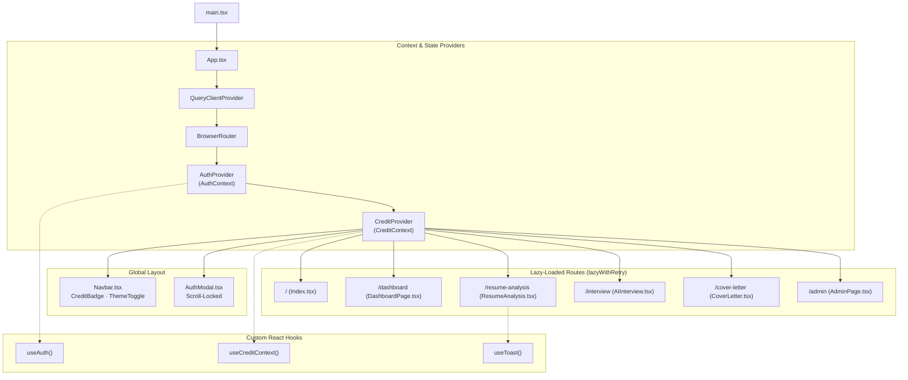

# Diagram 5: Frontend Architecture & Component Tree

[← Back to Architecture Hub](../README.md) · [← Documentation Hub](../../README.md)

---

## 💻 Frontend Component Hierarchy (At a Glance)

```
main.tsx (ReactDOM.createRoot)
 │
 ▼
App.tsx (Provider Wrapper Hierarchy)
 ├─► QueryClientProvider (TanStack Query client caching)
 ├─► TooltipProvider (Radix tooltip portal context)
 ├─► BrowserRouter (React Router DOM v6)
 ├─► AuthProvider (Manages user, session tokens, and ColdStartBanner)
 └─► CreditProvider (Manages live balance, deductLocal(), and shortfall calculation)
      │
      ├─► Navbar (Global navigation, theme toggle, credit balance badge)
      │
      ├─► Page Routes (Lazy-loaded with lazyWithRetry error boundaries)
      │    ├── /                     -> Index.tsx (Landing page, hero, feature marquee)
      │    ├── /dashboard            -> DashboardPage.tsx (Recent resumes & credits)
      │    ├── /resume-analysis      -> ResumeAnalysis.tsx (Upload, ATS score, deep critique)
      │    ├── /interview            -> AIInterview.tsx (Mock interview, voice input STT)
      │    ├── /cover-letter         -> CoverLetter.tsx (Role-targeted generator & humanizer)
      │    ├── /credits              -> CreditsPage.tsx (History audit log & feature pricing)
      │    ├── /interview/history    -> InterviewHistory.tsx (Past performance reports)
      │    ├── /admin                -> AdminPage.tsx (User activity modal & stats)
      │    ├── /pricing              -> Pricing.tsx (Plan tier comparison)
      │    └── /auth/callback        -> AuthCallback.tsx (Google OAuth PKCE exchange)
      │
      └─► Global Overlays & Modals
           ├── AuthModal.tsx (Sign-in/Sign-up with mobile scroll-lock)
           └── Footer.tsx (Site links and social badges)
```

---

## 📊 Technical Flowchart (Mermaid)



---

## 🧩 Key Component Responsibilities

| Component | Path | Core Responsibilities |
|---|---|---|
| `AuthModal` | `components/ui/AuthModal.tsx` | Handles email/password authentication & Google OAuth. Locks body scroll on mobile (`overflow: hidden`) during mount. |
| `ResumeAnalysis` | `pages/ResumeAnalysis.tsx` | Manages resume file upload, ATS score calculation, deep AI analysis, and hiring intelligence with 45s slow-load timer. |
| `AIInterview` | `pages/AIInterview.tsx` | Conducts 6-question mock interviews with audio recording via MediaRecorder, Whisper speech-to-text, and question-by-question grading. |
| `CreditContext` | `contexts/CreditContext.tsx` | Provides `credits`, `canUse()`, `deductLocal()` for optimistic deduction, and `refreshCredits()` for authoritative backend syncing. |
| `Navbar` | `components/sections/Navbar.tsx` | Displays live credit balance with dynamic color indicators, user avatar, and navigation links. |
