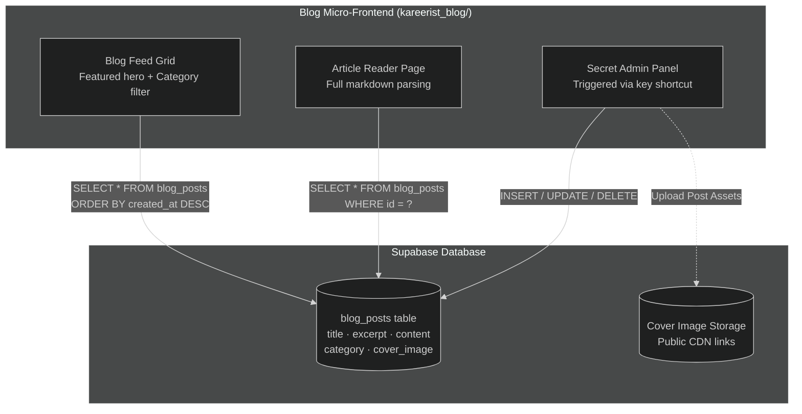

# Diagram 6: Blog System Architecture

[← Back to Architecture Hub](../README.md) · [← Documentation Hub](../../README.md)

---

> 💡 **Quick Visual Preview:** In Antigravity IDE / VS Code, press **Ctrl + Shift + V** (or click the **Open Preview to the Side** icon at top-right) to view this flowchart rendered visually.
> 🌐 **Interactive Canvas Viewer:** You can also open [architecture_viewer.html](../architecture_viewer.html) directly in any web browser to pan, zoom, and inspect components.

---


## 📰 Blog Micro-Frontend Architecture (At a Glance)

```
┌─────────────────────────────────────────────────────────────────────────────┐
│                          KAREERIST BLOG APPLICATION                         │
│                    (Standalone Vite + React Micro-Frontend)                 │
│                                                                             │
│  ├── /                -> Article List Grid & Featured Post Hero             │
│  ├── /article/:id     -> Markdown Reader & Social Sharing                   │
│  └── /admin           -> Secret Admin Portal (Ctrl+Shift+A)                 │
│                           • Create Post with Cover Preview                  │
│                           • Manage / Edit / Delete Articles                 │
└──────────────────────────────────────┬──────────────────────────────────────┘
                                       │ Direct Supabase JS Client (HTTPS)
                                       ▼
┌─────────────────────────────────────────────────────────────────────────────┐
│                         SUPABASE CMS (blog_posts)                           │
│  • Columns: id, title, excerpt, content (markdown), category, cover_image   │
│  • Public Read Policy: Any visitor can read published posts                 │
│  • Admin Write Policy: Secured via password/session key                     │
└─────────────────────────────────────────────────────────────────────────────┘
```

---

## 📊 Technical Flowchart (Mermaid)



---

## 🔑 Subsystem Specifications

| Component | Repository & Deployment | Technical Details |
|---|---|---|
| **Blog Application** | `kareerist_blog/` (Standalone repository) | React + Vite + Tailwind CSS. Deployed independently to Vercel. |
| **CMS Storage** | Supabase `blog_posts` table | PostgreSQL database storing rich article text, category tags, author metadata, and cover URLs. |
| **Admin Access** | In-app modal | Admin interface accessible by site administrators to compose, format, and publish articles without a full backend CMS. |
