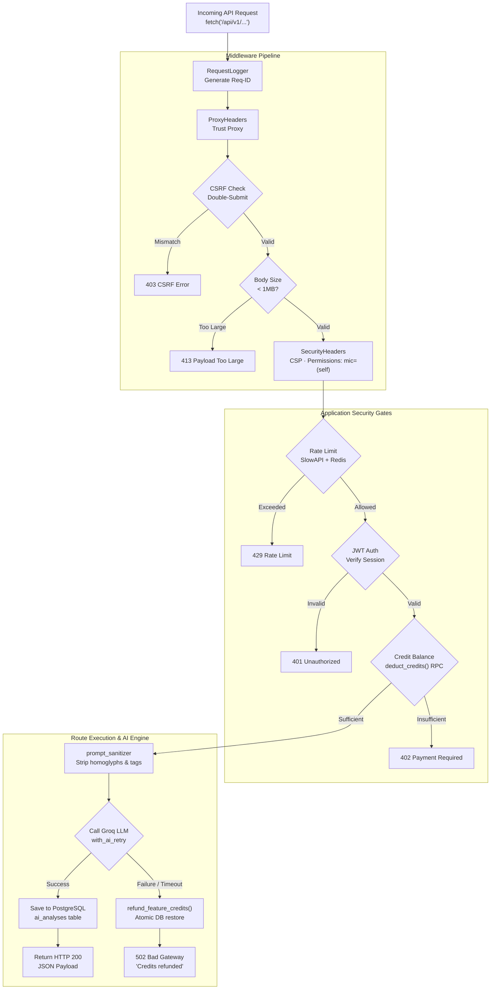

# Diagram 7: Request Lifecycle & Middleware Pipeline

[← Back to Architecture Hub](../README.md) · [← Documentation Hub](../../README.md)

---

## 🔁 Request Pipeline & Security Gates (At a Glance)

```
Incoming Client HTTP Request (e.g. POST /api/v1/analysis/deep)
 │
 ▼
┌─────────────────────────────────────────────────────────────────────────────┐
│                       GATE 1: MIDDLEWARE EXECUTION                          │
│  1. RequestLoggerMiddleware: Assigns X-Request-ID, starts timer             │
│  2. ProxyHeadersMiddleware: Trusts X-Forwarded-For from Render reverse proxy│
│  3. CSRFMiddleware: Checks X-CSRF-Token matches __krs_xsrf cookie (prod)   │
│  4. BodySizeLimitMiddleware: Rejects request body if > 1MB (413 Payload)    │
│  5. SecurityHeadersMiddleware: Sets CSP, HSTS, Permissions-Policy (mic=self)│
│  6. CORSMiddleware: Validates origin against allowlist                      │
└──────────────────────────────────────┬──────────────────────────────────────┘
                                       │ Pass
                                       ▼
┌─────────────────────────────────────────────────────────────────────────────┐
│                       GATE 2: RATE LIMITING (SlowAPI)                       │
│  • Looks up Redis counter for client IP & user key                          │
│  • If requests > quota -> Aborts with HTTP 429 Too Many Requests            │
└──────────────────────────────────────┬──────────────────────────────────────┘
                                       │ Pass
                                       ▼
┌─────────────────────────────────────────────────────────────────────────────┐
│                       GATE 3: AUTHENTICATION (JWT)                          │
│  • Reads __krs_sid cookie or Authorization: Bearer <token>                  │
│  • Validates JWT signature with Supabase Secret                             │
│  • If expired / invalid -> Aborts with HTTP 401 Unauthorized                │
└──────────────────────────────────────┬──────────────────────────────────────┘
                                       │ Pass
                                       ▼
┌─────────────────────────────────────────────────────────────────────────────┐
│                       GATE 4: CREDIT BALANCE CHECK                          │
│  • Checks user.is_unlimited (Admin bypass)                                  │
│  • Executes atomic PostgreSQL RPC deduct_credits(user_id, feature, cost)    │
│  • If balance < cost -> Aborts with HTTP 402 Payment Required               │
└──────────────────────────────────────┬──────────────────────────────────────┘
                                       │ Credits Deducted
                                       ▼
┌─────────────────────────────────────────────────────────────────────────────┐
│                       GATE 5: SERVICE LAYER EXECUTION                       │
│  • Sanitizes user inputs via prompt_sanitizer.py (NFKC, comments, tags)     │
│  • Executes external LLM / embedding with exponential retry                 │
│  • Failure Guard: If LLM times out, calls refund_feature_credits() on DB    │
│  • Persists analysis result to ai_analyses with user_id scoping             │
└──────────────────────────────────────┬──────────────────────────────────────┘
                                       │ 
                                       ▼
Outgoing JSON Response (HTTP 200 OK + Remaining Credits Header)
```

---

## 📊 Technical Flowchart (Mermaid)



---

## ⚡ Execution Gates Summary

| Gate | Component | Failure Code | Action Taken |
|---|---|---|---|
| **1. CSRF** | `CSRFMiddleware` | 403 Forbidden | Verifies double-submit cookie `__krs_xsrf` against `X-CSRF-Token` header. |
| **2. Size** | `BodySizeLimitMiddleware` | 413 Payload Too Large | Rejects any payload exceeding 1MB (upload endpoint permitted up to 5MB). |
| **3. Rate** | `SlowAPI` + `Redis` | 429 Too Many Requests | Protects backend against burst abuse and denial of service. |
| **4. Auth** | `get_current_user` | 401 Unauthorized | Validates cryptographic signature of session JWT cookie. |
| **5. Credit** | `deduct_credits` RPC | 402 Payment Required | Atomically subtracts cost. Unlimited users bypass this check. |
| **6. AI Guard**| `refund_feature_credits`| 502 Bad Gateway | Restores user credits if Groq API times out or fails JSON parsing. |
