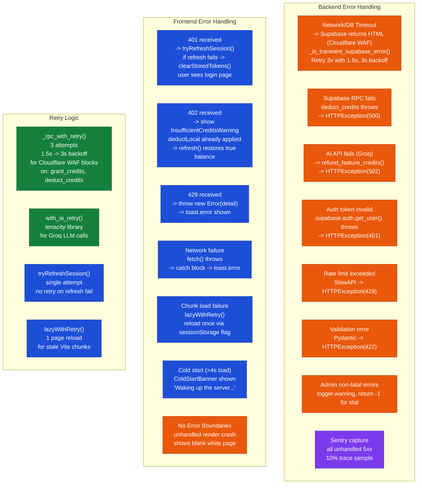

# Diagram 8: Error Handling & Failure Flow

[← Back to Master Index](../../ARCHITECTURE_FLOWCHARTS.md)

---

```mermaid
graph TD
    classDef backend fill:#15803d,color:#fff,stroke:#166534
    classDef error fill:#ea580c,color:#fff,stroke:#c2410c
    classDef external fill:#7c3aed,color:#fff,stroke:#6d28d9
    classDef frontend fill:#1d4ed8,color:#fff,stroke:#1e40af

    subgraph BACKEND_ERRORS["Backend Error Handling"]
        E1["Network/DB Timeout<br/>-> Supabase returns HTML (Cloudflare WAF)<br/>_is_transient_supabase_error()<br/>Retry 3x with 1.5s, 3s backoff"]
        E2["Supabase RPC fails<br/>deduct_credits throws<br/>-> HTTPException(500)"]
        E3["AI API fails (Groq)<br/>-> refund_feature_credits()<br/>-> HTTPException(502)"]
        E4["Auth token invalid<br/>supabase.auth.get_user() throws<br/>-> HTTPException(401)"]
        E5["Rate limit exceeded<br/>SlowAPI -> HTTPException(429)"]
        E6["Validation error<br/>Pydantic -> HTTPException(422)"]
        E7["Admin non-fatal errors<br/>logger.warning, return -1 for stat"]
        E8["Sentry capture<br/>all unhandled 5xx<br/>10% trace sample"]
    end

    subgraph FRONTEND_ERRORS["Frontend Error Handling"]
        FE1["401 received<br/>-> tryRefreshSession()<br/>if refresh fails -> clearStoredTokens()<br/>user sees login page"]
        FE2["402 received<br/>-> show InsufficientCreditsWarning<br/>deductLocal already applied<br/>-> refresh() restores true balance"]
        FE3["429 received<br/>-> throw new Error(detail)<br/>-> toast.error shown"]
        FE4["Network failure<br/>fetch() throws<br/>-> catch block -> toast.error"]
        FE5["Chunk load failure<br/>lazyWithRetry()<br/>reload once via sessionStorage flag"]
        FE6["Cold start (>4s load)<br/>ColdStartBanner shown<br/>'Waking up the server...'"]
        FE7["No Error Boundaries<br/> unhandled render crash<br/>shows blank white page"]
    end

    subgraph RETRY_LOGIC["Retry Logic"]
        R1["_rpc_with_retry()<br/>3 attempts<br/>1.5s -> 3s backoff<br/>for Cloudflare WAF blocks<br/>on: grant_credits, deduct_credits"]
        R2["with_ai_retry()<br/>tenacity library<br/>for Groq LLM calls"]
        R3["tryRefreshSession()<br/>single attempt<br/>no retry on refresh fail"]
        R4["lazyWithRetry()<br/>1 page reload<br/>for stale Vite chunks"]
    end
    class E1,E3,FE7,E2,E7,E4,E6,E5 error;
    class E8 external;
    class FE4,FE5,FE2,FE6,R4,R3,FE1,FE3 frontend;
    class R1,R2 backend;
```
