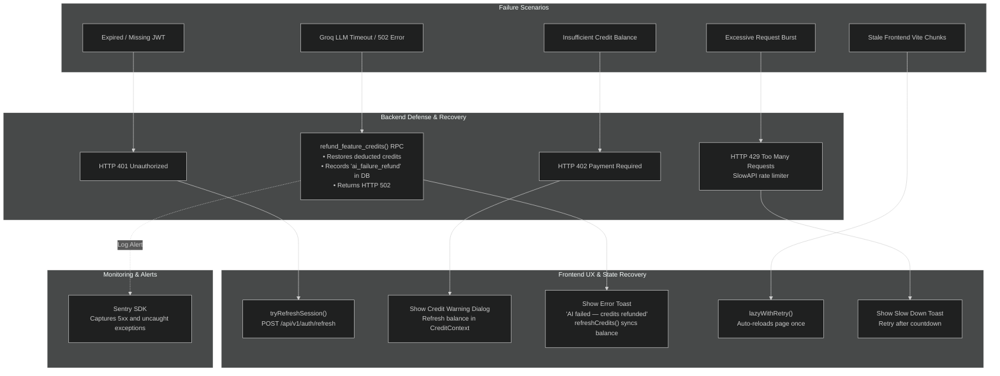

# Diagram 8: Error Handling & Failure Recovery

[← Back to Architecture Hub](../README.md) · [← Documentation Hub](../../README.md)

---

> 💡 **Quick Visual Preview:** In Antigravity IDE / VS Code, press **Ctrl + Shift + V** (or click the **Open Preview to the Side** icon at top-right) to view this flowchart rendered visually.
> 🌐 **Interactive Canvas Viewer:** You can also open [architecture_viewer.html](../architecture_viewer.html) directly in any web browser to pan, zoom, and inspect components.

---


## 🛠️ Error Propagation & Recovery (At a Glance)

```
┌─────────────────────────┐
│     CLIENT ACTION       │
│  User triggers feature  │
└────────────┬────────────┘
             │
             ▼
┌─────────────────────────┐      HTTP 401 Session Expired
│   FASTAPI API GATEWAY   ├───────────────────────────────────► Frontend tryRefreshSession()
│   Validates JWT token   │                                     • Success: Retry original request
└────────────┬────────────┘                                     • Fail: Clear state -> redirect to login
             │
             ▼
┌─────────────────────────┐      HTTP 402 Insufficient Balance
│  ATOMIC CREDIT DEDUCT   ├───────────────────────────────────► Frontend InsufficientCreditsWarning
│  deduct_credits() RPC   │                                     • Re-fetch balance from server
└────────────┬────────────┘                                     • Show upgrade / daily grant info
             │
             ▼
┌─────────────────────────┐      LLM Timeout / Groq Error
│     AI SERVICE CALL     ├───────────────────────────────────► AUTOMATIC CREDIT REFUND
│   Groq LLM / Whisper    │                                     1. Backend calls refund_feature_credits()
└────────────┬────────────┘                                     2. Inserts 'ai_failure_refund' in audit log
             │                                                  3. Returns HTTP 502 Bad Gateway
             ▼                                                  4. Frontend displays user-friendly toast:
┌─────────────────────────┐                                        "AI failed — credits refunded. Try again."
│ SUCCESSFUL 200 RESPONSE │
│ Data saved & delivered  │
└─────────────────────────┘
```

---

## 📊 Technical Flowchart (Mermaid)



---

## 🔄 Failure Recovery Strategies

| Failure Type | Trigger Condition | Automated Recovery Flow | User Experience |
|---|---|---|---|
| **AI LLM Failure** | Groq times out (>45s) or returns malformed response | Backend calls `refund_feature_credits()` to restore balance atomically, logs transaction as `ai_failure_refund`, raises 502. | Error toast: *"Deep analysis failed — your credits have been refunded. Please try again."* No credits lost. |
| **Token Expiry** | Access JWT expires (1h) | Frontend intercepts 401, calls `tryRefreshSession()` with refresh token cookie. | Seamless automatic refresh. If refresh token is expired, prompts sign-in. |
| **Chunk Loading** | New deployment updates JS bundle hashes | `lazyWithRetry()` catches dynamic `import()` failures and forces a clean page reload once. | Seamless refresh to the latest app version instead of a broken white screen. |
| **Cold Start** | Render backend sleeps after inactivity | `AuthContext` starts 4s timer; if loading exceeds 4s, renders `ColdStartBanner`. | Informative amber banner: *"Waking up server (15–30s)..."* |
| **Slow LLM Call** | Hiring Intel takes 30–60s on complex resumes | `ResumeAnalysis.tsx` triggers 45s timer displaying amber status indicator. | Status message: *"⏳ Still working — Hiring Intel is thorough (30–60s). Hang tight..."* |
