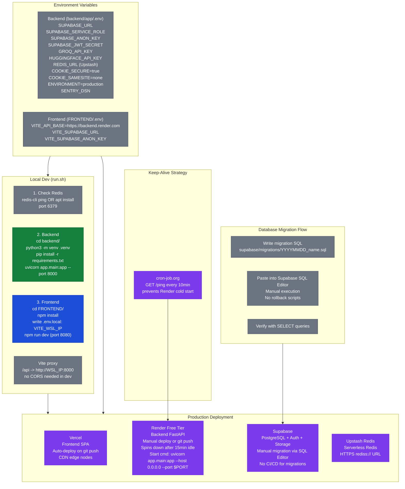

# Diagram 9: Deployment & Environment Flow

[← Back to Master Index](../../ARCHITECTURE_FLOWCHARTS.md)

---

```mermaid
graph TD
    classDef frontend fill:#1d4ed8,color:#fff,stroke:#1e40af
    classDef backend fill:#15803d,color:#fff,stroke:#166534
    classDef config fill:#6b7280,color:#fff,stroke:#4b5563
    classDef external fill:#7c3aed,color:#fff,stroke:#6d28d9

    subgraph LOCAL[" Local Dev (run.sh)"]
        L1["1. Check Redis<br/>redis-cli ping OR apt install<br/>port 6379"]
        L2["2. Backend<br/>cd backend/<br/>python3 -m venv .venv<br/>pip install -r requirements.txt<br/>uvicorn app.main:app --port 8000"]
        L3["3. Frontend<br/>cd FRONTEND/<br/>npm install<br/>write .env.local: VITE_WSL_IP<br/>npm run dev (port 8080)"]
        L4["Vite proxy<br/>/api -> http://WSL_IP:8000<br/>no CORS needed in dev"]
    end

    subgraph ENV_VARS["Environment Variables"]
        BE_ENV["Backend (backend/app/.env)<br/>SUPABASE_URL<br/>SUPABASE_SERVICE_ROLE<br/>SUPABASE_ANON_KEY<br/>SUPABASE_JWT_SECRET<br/>GROQ_API_KEY<br/>HUGGINGFACE_API_KEY<br/>REDIS_URL (Upstash)<br/>COOKIE_SECURE=true<br/>COOKIE_SAMESITE=none<br/>ENVIRONMENT=production<br/>SENTRY_DSN"]
        FE_ENV["Frontend (FRONTEND/.env)<br/>VITE_API_BASE=https://backend.render.com<br/>VITE_SUPABASE_URL<br/>VITE_SUPABASE_ANON_KEY"]
    end

    subgraph PROD[" Production Deployment"]
        VERCEL["Vercel<br/>Frontend SPA<br/>Auto-deploy on git push<br/>CDN edge nodes"]
        RENDER["Render Free Tier<br/>Backend FastAPI<br/>Manual deploy or git push<br/>Spins down after 15min idle<br/>Start cmd: uvicorn app.main:app --host 0.0.0.0 --port $PORT"]
        SUPABASE_PROD["Supabase<br/>PostgreSQL + Auth + Storage<br/>Manual migration via SQL Editor<br/>No CI/CD for migrations"]
        UPSTASH["Upstash Redis<br/>Serverless Redis<br/>HTTPS rediss:// URL"]
    end

    subgraph MIGRATIONS["Database Migration Flow"]
        M1["Write migration SQL<br/>supabase/migrations/YYYYMMDD_name.sql"]
        M2["Paste into Supabase SQL Editor<br/>Manual execution<br/>No rollback scripts"]
        M3["Verify with SELECT queries"]
    end

    subgraph KEEPALIVE["Keep-Alive Strategy"]
        CRON["cron-job.org<br/>GET /ping every 10min<br/>prevents Render cold start"]
    end

    LOCAL --> PROD
    ENV_VARS --> LOCAL
    ENV_VARS --> PROD
    MIGRATIONS --> SUPABASE_PROD
    CRON --> RENDER
    class BE_ENV,FE_ENV,M3,L1,M1,L4,M2 config;
    class L2 backend;
    class L3 frontend;
    class CRON,RENDER,SUPABASE_PROD,UPSTASH,VERCEL external;
```
