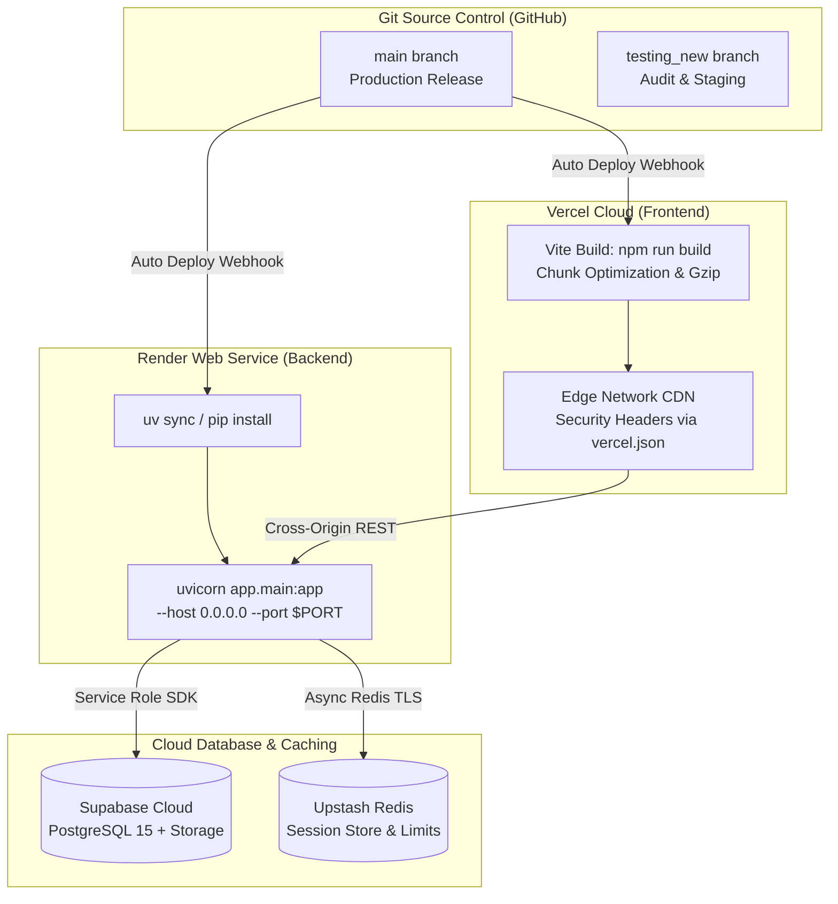

# Diagram 9: Production Deployment & Environment Topology

[← Back to Architecture Hub](../README.md) · [← Documentation Hub](../../README.md)

---

## 🌐 Deployment Topology (At a Glance)

```
┌─────────────────────────────────────────────────────────────────────────────┐
│                          GLOBAL EDGE CDN (Vercel)                           │
│  • React 18 + Vite Production Bundle                                        │
│  • Automated CI/CD on git push to main                                      │
│  • Custom security headers via FRONTEND/vercel.json                         │
│  • Client-side routing rewrite: /(.*) -> /index.html                        │
└──────────────────────────────────────┬──────────────────────────────────────┘
                                       │ HTTPS Cross-Origin API Calls
                                       ▼
┌─────────────────────────────────────────────────────────────────────────────┐
│                         WEB SERVICE (Render Free Tier)                      │
│  • Python 3.13 + FastAPI + Uvicorn                                          │
│  • Working Directory: backend/                                              │
│  • Start Command: uvicorn app.main:app --host 0.0.0.0 --port $PORT          │
│  • Cold Start Prevention: cron-job.org pings /ping every 10 minutes         │
└──────────────┬───────────────────────┬───────────────────────┬──────────────┘
               │                       │                       │
               ▼                       ▼                       ▼
┌───────────────────────────┐ ┌───────────────────┐ ┌─────────────────────────┐
│     SUPABASE (Managed)    │ │   UPSTASH REDIS   │ │    EXTERNAL SERVICES    │
│ • PostgreSQL 15 Database  │ │ • Serverless      │ │ • Groq Cloud (Qwen)     │
│ • Supabase Auth Service   │ │   In-Memory Cache │ │ • Groq Whisper (STT)    │
│ • PDF Storage Buckets     │ │ • SSL rediss://   │ │ • Sentry Error Tracking │
└───────────────────────────┘ └───────────────────┘ └─────────────────────────┘
```

---

## 📊 Technical Flowchart (Mermaid)



---

## ⚙️ Environment Configuration

| Variable | Platform | Secret? | Description |
|---|---|---|---|
| `VITE_API_BASE` | Vercel | No | Base URL of the deployed FastAPI backend on Render. |
| `VITE_SUPABASE_URL` | Vercel | No | Supabase project API endpoint. |
| `VITE_SUPABASE_ANON_KEY` | Vercel | No | Public Supabase anon key for OAuth initialization. |
| `SUPABASE_SERVICE_ROLE` | Render | 🔒 Yes | Backend admin key with full database and RPC authority. |
| `SUPABASE_JWT_SECRET` | Render | 🔒 Yes | Secret key used to cryptographically verify user JWT cookies. |
| `GROQ_API_KEY` | Render | 🔒 Yes | API key for LLM analysis, interview generation, and Whisper STT. |
| `REDIS_URL` | Render | 🔒 Yes | Secure Upstash Redis URI (`rediss://...`) for session management. |
| `SENTRY_DSN` | Render & Vercel | 🔒 Yes | Sentry telemetry monitoring connection string. |
