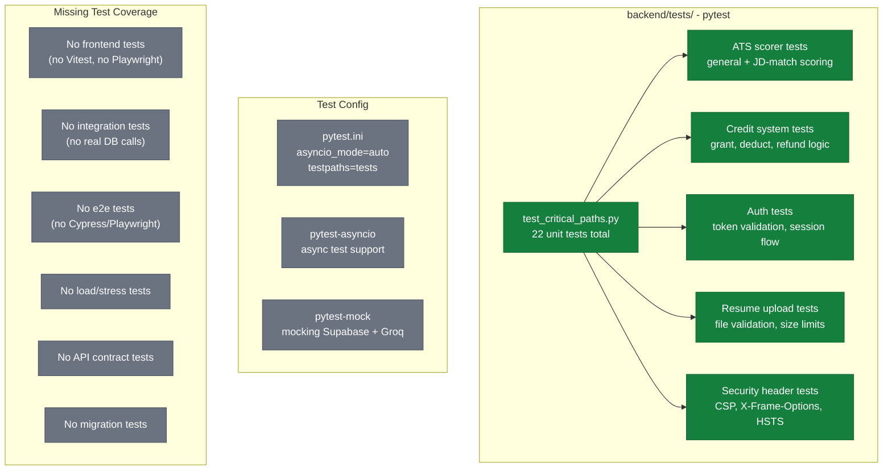

# Diagram 10: QA & Testing Flow

[← Back to Master Index](../../ARCHITECTURE_FLOWCHARTS.md)

---

```mermaid
graph TD
    classDef backend fill:#15803d,color:#fff,stroke:#166534
    classDef config fill:#6b7280,color:#fff,stroke:#4b5563

    subgraph TEST_SUITE["backend/tests/ - pytest"]
        T1["test_critical_paths.py<br/>22 unit tests total"]
        T2["ATS scorer tests<br/>general + JD-match scoring"]
        T3["Credit system tests<br/>grant, deduct, refund logic"]
        T4["Auth tests<br/>token validation, session flow"]
        T5["Resume upload tests<br/>file validation, size limits"]
        T6["Security header tests<br/>CSP, X-Frame-Options, HSTS"]
    end

    subgraph TEST_CONFIG["Test Config"]
        P1["pytest.ini<br/>asyncio_mode=auto<br/>testpaths=tests"]
        P2["pytest-asyncio<br/>async test support"]
        P3["pytest-mock<br/>mocking Supabase + Groq"]
    end

    subgraph GAPS[" Missing Test Coverage"]
        G1["No frontend tests<br/>(no Vitest, no Playwright)"]
        G2["No integration tests<br/>(no real DB calls)"]
        G3["No e2e tests<br/>(no Cypress/Playwright)"]
        G4["No load/stress tests"]
        G5["No API contract tests"]
        G6["No migration tests"]
    end

    T1 --> T2
    T1 --> T3
    T1 --> T4
    T1 --> T5
    T1 --> T6
    class T1,T3,T6,T5,T2,T4 backend;
    class G5,G3,G4,G6,G1,P2,P1,G2,P3 config;
```
