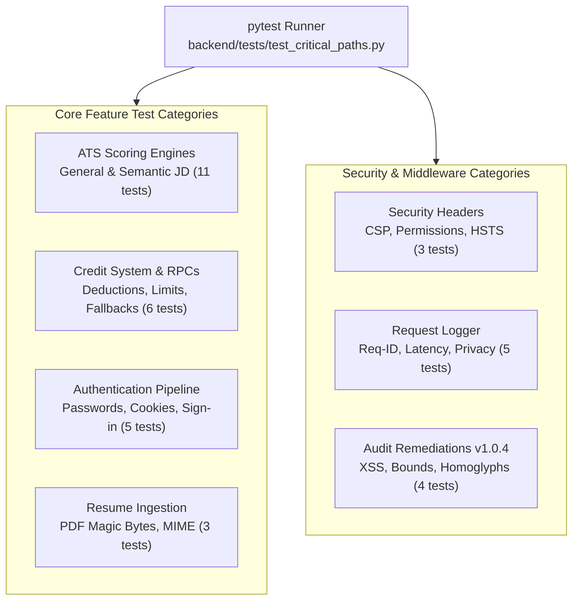

# Diagram 10: Automated QA & Security Testing Suite

[← Back to Architecture Hub](../README.md) · [← Documentation Hub](../../README.md)

---

## 🧪 Test Suite Hierarchy (37 Automated Tests)

```
pytest backend/tests/ -v (Total: 37 tests · 100% passing)
 │
 ├── 1. TestATSGeneralScorer (8 tests)
 │   ├── test_good_resume_scores_above_50
 │   ├── test_poor_resume_scores_below_40
 │   ├── test_empty_resume_returns_low_score
 │   ├── test_score_is_always_integer
 │   ├── test_score_never_exceeds_100
 │   ├── test_breakdown_keys_present
 │   ├── test_contact_info_detection
 │   └── test_note_field_present_in_general_mode
 │
 ├── 2. TestATSWithJD (3 tests)
 │   ├── test_falls_back_to_general_when_embedding_fails
 │   ├── test_no_jd_uses_general_scorer
 │   └── test_with_jd_uses_embedding_mode
 │
 ├── 3. TestCreditSystem (6 tests)
 │   ├── test_insufficient_credits_raises_402
 │   ├── test_unlimited_user_skips_rpc
 │   ├── test_successful_deduction_returns_remaining
 │   ├── test_low_credits_flag_set_below_threshold
 │   ├── test_user_not_found_raises_404
 │   └── test_feature_costs_all_defined
 │
 ├── 4. TestAuthEndpoints (5 tests)
 │   ├── test_login_wrong_password_returns_401
 │   ├── test_login_missing_fields_returns_422
 │   ├── test_login_invalid_email_format_returns_422
 │   ├── test_me_without_cookie_returns_401
 │   └── test_logout_always_succeeds
 │
 ├── 5. TestResumeUpload (3 tests)
 │   ├── test_non_pdf_rejected
 │   ├── test_fake_pdf_magic_bytes_rejected
 │   └── test_upload_without_auth_returns_401
 │
 ├── 6. TestSecurityHeaders (3 tests)
 │   ├── test_security_headers_present_on_all_responses
 │   ├── test_csp_blocks_frame_ancestors
 │   └── test_health_endpoint_returns_ok
 │
 ├── 7. TestRequestLogger (5 tests)
 │   ├── test_request_id_header_in_response
 │   ├── test_request_id_is_unique_per_request
 │   ├── test_log_emitted_for_api_request
 │   ├── test_health_path_not_logged
 │   └── test_json_log_format_in_production
 │
 └── 8. TestSecurityAuditRemediations (4 tests) [Added in v1.0.4]
     ├── test_full_name_sanitization_strips_xss_tags
     ├── test_permissions_policy_allows_microphone
     ├── test_humanize_request_bounds
     └── test_prompt_sanitizer_homoglyphs_and_nested
```

---

## 📊 Technical Flowchart (Mermaid)



---

## 📋 Test Execution & Metrics

```bash
# Run all backend critical path tests
cd backend
pytest tests/ -v
```

- **Execution Time:** ~1.99 seconds.
- **Pass Rate:** 37 / 37 (100%).
- **Mocking Strategy:** Uses `pytest-mock` to isolate external dependencies (Groq LLM API, HuggingFace embeddings, and Supabase RPCs) so tests execute rapidly and deterministically offline.
