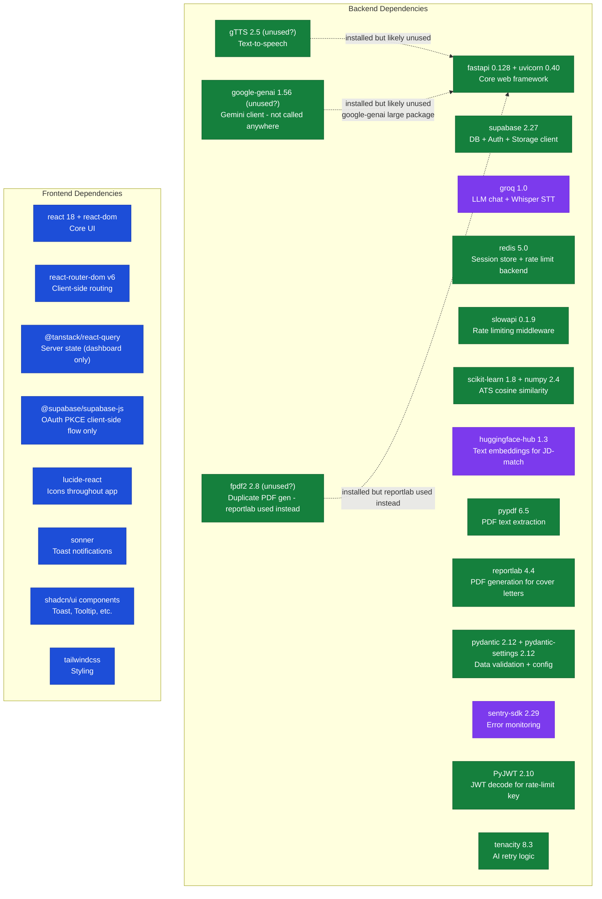

# Diagram 12: Dependency & Module Map

[← Back to Master Index](../../ARCHITECTURE_FLOWCHARTS.md)

---

```mermaid
graph TD
    classDef backend fill:#15803d,color:#fff,stroke:#166534
    classDef frontend fill:#1d4ed8,color:#fff,stroke:#1e40af
    classDef external fill:#7c3aed,color:#fff,stroke:#6d28d9

    subgraph BACKEND_DEPS["Backend Dependencies"]
        BD1["fastapi 0.128 + uvicorn 0.40<br/>Core web framework"]
        BD2["supabase 2.27<br/>DB + Auth + Storage client"]
        BD3["groq 1.0<br/>LLM chat + Whisper STT"]
        BD4["redis 5.0<br/>Session store + rate limit backend"]
        BD5["slowapi 0.1.9<br/>Rate limiting middleware"]
        BD6["scikit-learn 1.8 + numpy 2.4<br/>ATS cosine similarity"]
        BD7["huggingface-hub 1.3<br/>Text embeddings for JD-match"]
        BD8["pypdf 6.5<br/>PDF text extraction"]
        BD9["reportlab 4.4<br/>PDF generation for cover letters"]
        BD10["pydantic 2.12 + pydantic-settings 2.12<br/>Data validation + config"]
        BD11["sentry-sdk 2.29<br/>Error monitoring"]
        BD12["PyJWT 2.10<br/>JWT decode for rate-limit key"]
        BD13["tenacity 8.3<br/>AI retry logic"]
        BD14["gTTS 2.5 (unused?)<br/>Text-to-speech"]
        BD15["google-genai 1.56 (unused?)<br/>Gemini client - not called anywhere"]
        BD16["fpdf2 2.8 (unused?)<br/>Duplicate PDF gen - reportlab used instead"]
    end

    subgraph FRONTEND_DEPS["Frontend Dependencies"]
        FD1["react 18 + react-dom<br/>Core UI"]
        FD2["react-router-dom v6<br/>Client-side routing"]
        FD3["@tanstack/react-query<br/>Server state (dashboard only)"]
        FD4["@supabase/supabase-js<br/>OAuth PKCE client-side flow only"]
        FD5["lucide-react<br/>Icons throughout app"]
        FD6["sonner<br/>Toast notifications"]
        FD7["shadcn/ui components<br/>Toast, Tooltip, etc."]
        FD8["tailwindcss<br/>Styling"]
    end

    BD14 -.->|installed but likely unused| BD1
    BD15 -.->|installed but likely unused<br/>google-genai large package| BD1
    BD16 -.->|installed but reportlab used instead| BD1
    class BD1,BD14,BD13,BD9,BD16,BD4,BD15,BD10,BD5,BD8,BD2,BD12,BD6 backend;
    class BD3,BD11,BD7 external;
    class FD7,FD4,FD8,FD6,FD5,FD1,FD2,FD3 frontend;
```
