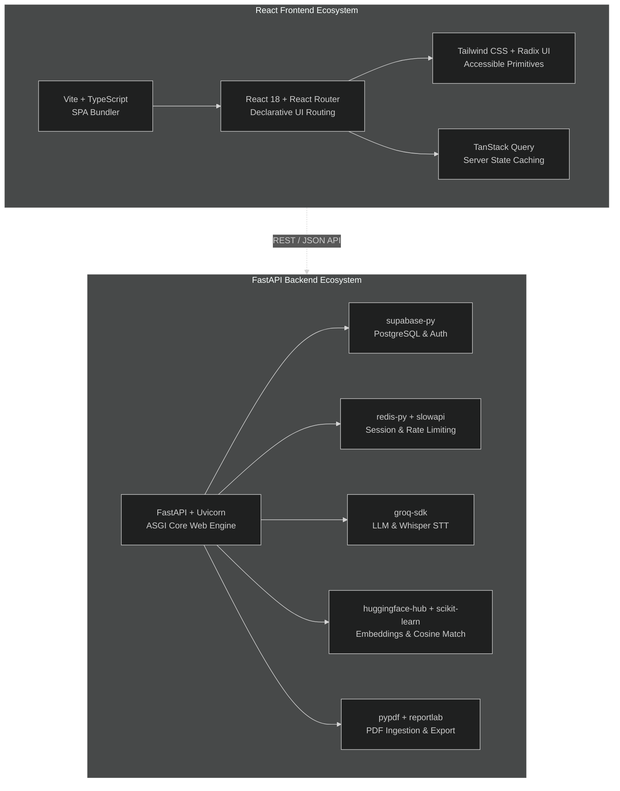

# Diagram 12: Dependency & Module Map

[← Back to Architecture Hub](../README.md) · [← Documentation Hub](../../README.md)

---

> 💡 **Quick Visual Preview:** In Antigravity IDE / VS Code, press **Ctrl + Shift + V** (or click the **Open Preview to the Side** icon at top-right) to view this flowchart rendered visually.
> 🌐 **Interactive Canvas Viewer:** You can also open [architecture_viewer.html](../architecture_viewer.html) directly in any web browser to pan, zoom, and inspect components.

---


## 📦 Dependency Ecosystem (At a Glance)

```
┌─────────────────────────────────────────────────────────────────────────────┐
│                            BACKEND (Python 3.13)                            │
│                                                                             │
│  • Framework & Server:     fastapi (0.128), uvicorn (0.40), pydantic (2.12) │
│  • Database & Auth:        supabase (2.27), PyJWT (2.10)                    │
│  • Caching & Rate Limiting:redis (5.0), slowapi (0.1.9)                     │
│  • AI & Machine Learning:  groq (1.0), huggingface-hub (1.3), tenacity (8.3)│
│  • Document & NLP:         pypdf (6.5), reportlab (4.4), scikit-learn (1.8) │
│  • Telemetry & Monitoring: sentry-sdk (2.29)                                │
└─────────────────────────────────────────────────────────────────────────────┘

┌─────────────────────────────────────────────────────────────────────────────┐
│                            FRONTEND (Node.js 18+)                           │
│                                                                             │
│  • Core UI & Build:        react (18.3), react-dom, vite (5.4), typescript  │
│  • Routing & State:        react-router-dom (v6), @tanstack/react-query     │
│  • Styling & Animations:   tailwindcss (3.4), framer-motion (11.0)          │
│  • UI Primitives:          @radix-ui/* (dialog, tooltip, toast), shadcn/ui  │
│  • Icons & Utilities:      lucide-react, sonner, jsPDF, html2canvas         │
│  • Client Auth:            @supabase/supabase-js (v2.49)                    │
└─────────────────────────────────────────────────────────────────────────────┘
```

---

## 📊 Technical Flowchart (Mermaid)



---

## 🔍 Module Evaluation & Architecture Notes

| Dependency | Category | Usage & Evaluation |
|---|---|---|
| `groq` | External AI | Primary provider for Deep Analysis, Hiring Intel, Cover Letters, and Whisper STT. |
| `huggingface-hub` | External AI | Provides `all-mpnet-base-v2` embeddings for ATS cosine similarity when a JD is provided. |
| `redis` | Infrastructure | Backs SlowAPI rate limiting and stores active interview state (45-minute TTL). |
| `reportlab` | PDF Service | Generates downloadable cover letter PDF documents server-side. |
| `pypdf` | Document Processing | Extracts text from candidate resumes during initial upload. |
| `sentry-sdk` | Telemetry | Captures unhandled 5xx exceptions and monitors performance (10% trace rate). |
