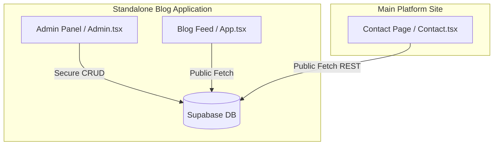

# Kareerist Blog Overview

**Location:** `prsnl/kareerist_blog/`  
**Type:** Standalone Sub-Repository / Sub-Application (Blog Publishing System)

## What This Module Does

This sub-repository houses the **Kareerist Blog System**, a standalone, highly performant publishing platform. Built as an isolated frontend application with React and Vite, it allows the team to write, publish, and order high-quality career articles (such as ATS resume advice, interview guides, and cover letter formulas). It integrates directly with a Supabase database instance to manage content dynamically without requiring a backend API server.

## Architectural Architecture & Integrations

The blog system is designed with a lightweight, high-performance architecture:

### 1. Zero-Backend CRUD Management
The admin panel inside `kareerist_blog` communicates **directly** with Supabase tables to perform CRUD operations (Create, Read, Update, Delete) on blog posts. Security is maintained using custom-configured Supabase Row-Level Security (RLS) policies that authorize operations.

### 2. Standalone Hosting isolation
The blog is built, compiled, and hosted as an independent project (e.g. on Vercel) separate from the main platform. This isolation ensures that:
- Any blog modifications or updates do not affect the main platform's stability.
- The blog loads extremely fast, maximizing SEO indexability.
- Development processes (dependencies, build pipelines) are kept completely modular.

### 3. Cross-Site Content Integration
While the blog is standalone, it integrates seamlessly with the main Kareerist platform:
- The main platform's **Contact Page** (`Contact.tsx`) performs direct REST API calls targeting the same Supabase database to fetch the 3 most recent blog posts, embedding them dynamically inside the main site to drive user engagement.

## Database Schema & RLS Security

The system runs on the `public.blog_posts` table in Supabase. It uses a custom-configured RLS schema:
- **`Allow public read access`**: Anyone (anonymous or authenticated) can fetch articles.
- **`Allow anon to insert/update/delete`**: The Admin Panel uses client-side passcode authentication to unlock CRUD features. This is a lightweight, serverless design that allows the admin panel to publish articles directly from the browser.

## Key Files in This Module

1. **`App.tsx`**: The main blog feed rendering engine, article routing system, and custom Markdown-to-HTML parser.
2. **`Admin.tsx`**: The password-protected administrative interface containing dashboard panels to create, edit, order, and delete blog posts.
3. **`supabase.ts`**: The Supabase client initializer and shared TypeScript interfaces.
4. **`supabase_migration.sql`**: The SQL migration script creating the `blog_posts` table, indexing parameters, and setting up the RLS policies.
