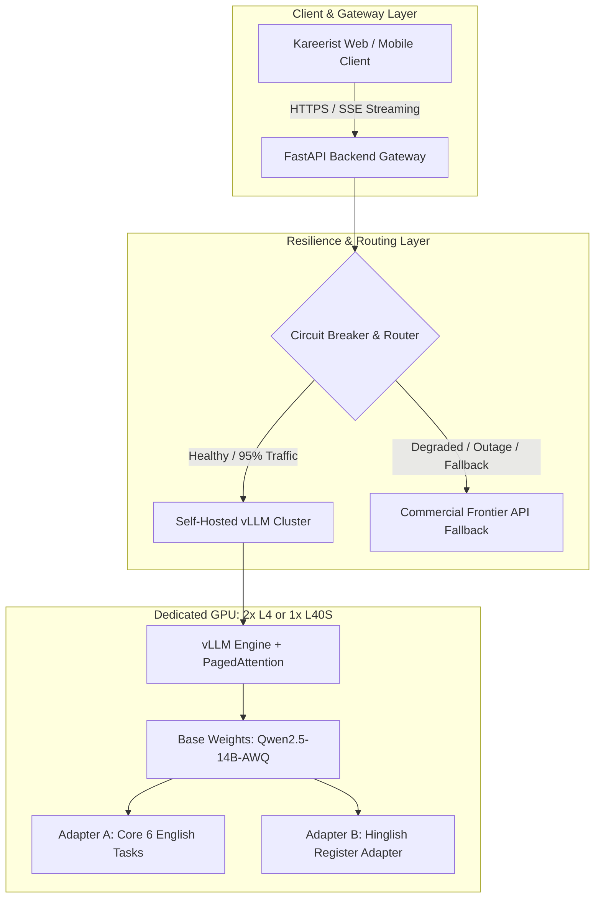

# 00 — Executive Summary & Funding Brief
### *Part D of the Kareerist Self-Hosted AI Models Blueprint*
**Audience:** Leadership, Investors, Technical Founders, and Budget Approvers

---

## 1. Executive Summary & Core Strategy

Right now, Kareerist operates like a restaurant without an internal kitchen: when a candidate submits a resume, the backend sends an API request to a proprietary provider (OpenAI, Anthropic, or Google), pays per token, and waits for a response formatted to prompt instructions.

Transitioning to self-hosted models builds a dedicated internal kitchen:
* **Pre-training is off the table:** Building a model from raw internet crawl data costs $5M to $500M in compute, hundreds of thousands of GPU hours, and a dedicated research team.
* **Fine-Tuning adapts an existing brain:** Open-weight foundation models (such as `Qwen/Qwen2.5-14B-Instruct` or `Qwen2.5-7B-Instruct`) already possess strong reasoning, grammar, and world knowledge. Fine-tuning conditions their style, output schema, and behavioral persona to match Kareerist guidelines.
* **Fine-tuning alters behavior and tone, not fundamental reasoning:** A 7B parameter model cannot synthesize reasoning capabilities it never possessed. It learns your schema, tone, and surface patterns, which is why data cleanliness and task scoping are paramount.



---

## 2. Restated Goal (Honest Version)

> **Build Kareerist-Core**, a self-hosted inference cluster running open-weight models that handles **90–95% of routine career workflows** at predictable cost and lower latency, while preserving our direct, calibrated recruiter persona. Maintain a **permanent commercial frontier API fallback** for outages, complex edge cases, and high-stakes reasoning.

Three deliberate principles:
1. **Not 100% independence:** Claiming "zero API dependency" creates a single point of failure. A permanent fallback behind an automated circuit breaker provides true production reliability.
2. **Permissive teachers only:** Distilling closed models (Claude, GPT-4o) violates their Terms of Service and taints company IP. We distill exclusively from permissively-licensed models (DeepSeek-V3 MIT, Qwen Apache 2.0).
3. **Measured gates:** No feature is migrated on intuition. Every migration requires passing an objective evaluation harness with a $\ge 45\%$ blind pairwise win-rate against the commercial baseline.

---

## 3. What the Original Strategy Got Right

* **Don't pre-train; fine-tune an open-weight 7B–14B SLM:** Specializing an open-weight foundation model via QLoRA is the industry standard for production vertical AI.
* **vLLM Inference Engine:** High-performance PagedAttention and continuous batching are essential for production serving.
* **OpenAI-Compatible API:** Keeps frontend and backend code modular, standard, and vendor-agnostic.
* **Multi-task efficiency over 6 separate models:** Loading one foundation model into VRAM avoids expensive weight swaps.
* **Synthetic distillation:** Using high-capacity teacher models to generate gold-standard training data is the fastest way to bootstrap domain datasets.

---

## 4. The Seven Flaws in the Original Document

1. **Teacher Licensing Violation:** Distilling Claude or OpenAI outputs violates their Terms of Service, creating legal liability.  
   *Fix: Use DeepSeek-V3 (MIT) or Qwen2.5-72B (Apache 2.0).*
2. **Context Length Truncation Bug:** `max_seq_length = 4096` truncates long resumes, teaching the model to output broken JSON.  
   *Fix: Set 8,192 tokens with hard validation assertions.*
3. **Missing Response Masking:** Lack of `train_on_responses_only` wastes 60% of training cycles memorizing inputs.  
   *Fix: Apply completion-only loss masking.*
4. **No Evaluation Framework:** Flying blind without automated benchmarks or regression suites.  
   *Fix: Deploy `run_eval.py` first.*
5. **Cost Estimates Off by 10x:** Real R&D costs ~$1,000, and redundant serving costs ~$750/month. Break-even occurs at ~500 DAU.
6. **Eliminating the Fallback Creates a SPOF:** Single-GPU self-hosting without a backup guarantees production downtime.  
   *Fix: Retain a permanent circuit-breaker fallback.*
7. **Ignoring Hiring Bias & Regulation:** Scoring candidates without bias checks violates algorithmic hiring frameworks.  
   *Fix: Enforce counterfactual demographic testing.*

---

## 5. The Two Highest-ROI Interventions

* **Deconstruct Deep Resume Analysis into 6 Parallel Sub-Tasks:** Resolves latency bottlenecks, prevents context truncation, and improves user experience immediately—even on existing APIs.
* **Curate 800 Human-Authored Hinglish Examples:** Frontier AI models produce stiff, unnatural Hinglish. Native-speaker curation is the only way to achieve authentic phrasing.

---

## 6. Financial Reality & Break-Even Analysis

### Capital & Infrastructure Expenditure Comparison

| Expense Category | Original v1 Claim | Corrected v2 Reality | Variance Driver |
| :--- | :--- | :--- | :--- |
| **Synthetic Dataset Synthesis** | $90 – $130 | **$120 – $250** | DeepSeek-V3 Batch API with prompt caching. |
| **Human Hinglish Annotation** | $0 (Unbudgeted) | **$400 – $800** | Compensating 3 native engineers for 800 samples. |
| **Training GPU Compute** | $8 – $12 | **$150 – $350** | 8 to 12 iterative training runs on A100-80GB. |
| **Evaluation Judge Inference** | $0 (Unbudgeted) | **$50 – $120** | Automated scoring over golden test sets. |
| **Total One-Time R&D Cost** | **~$110** | **~$720 – $1,520** | **~7x - 13x adjustment** |
| **Monthly Dedicated Serving** | $120 – $140/mo | **$500 – $900/mo** | 2x NVIDIA L4 instances for high-availability redundancy. |
| **Monitoring & Telemetry** | $0 (Unbudgeted) | **$40 – $80/mo** | Managed metrics, logs, and tracing infrastructure. |
| **Permanent Fallback Reserve** | $0 (Eliminated) | **$50 – $200/mo** | 5% tail traffic routed to commercial frontier API. |
| **Total Ongoing Monthly Cost**| **~$130/mo** | **~$590 – $1,180/mo** | **~5x - 9x adjustment** |

### Real Break-Even Formula
* **Commercial Frontier Cost (Optimized):** ~$0.025 per sectioned resume audit.
* **Fixed Self-Hosting Infrastructure:** ~$750/month.
$$\text{Break-Even Volume} = \frac{\$750}{\$0.025} = 30,000\text{ queries/month} \approx 500\text{ DAU}$$

```
Daily Active Users (DAU)  │ Financial Verdict
──────────────────────────┼──────────────────────────────────────────────────────────
< 200 DAU                 │ Self-hosting operates at a net loss. Execute Phase 0 only.
200 – 600 DAU             │ Parity zone. Justified by control, not cost savings.
> 600 DAU                 │ Substantial cost savings. Self-hosting strongly recommended.
```

---

## 7. The Uncomfortable Bottom Line

The original document had sound technical instincts wrapped in fabricated numbers. Its strategic core—fine-tuning an open-weight model, serving via vLLM, and distilling from high-capacity teachers—is what mature engineering organizations do.

However, **Phase 0 captures 60–80% of the cost savings in one week with no GPU, no training, and zero operational risk.** Structured outputs, prompt caching, sectioned parallel calls, tiered routing, and streaming will take you further, faster, than three months of fine-tuning.

Self-hosting is worth executing—for persona control, latency consistency, data residency, and proprietary IP creation—**once you sustain ~400–600 DAU.** Execute deliberately, feature by feature, measured at every step, with the safety net wired in from day one and never removed.

---

## 8. Definition of Project Success

* **$\ge 90\%$** of routine career AI queries served by the self-hosted cluster.
* **$\ge 45\%$** blind win/tie rate against commercial frontier models on golden evaluation sets.
* **$\ge 40\%$** lower marginal cost per analysis compared to commercial APIs at current traffic levels.
* **p95 Latency $< 20$ seconds** for complete multi-section resume evaluations.
* **100% High Availability** maintained via an automated circuit-breaker fallback.
* **Zero Algorithmic Bias** across demographic variants, verified via automated CI pipelines.
* **Hiring Intelligence intentionally retained on frontier models**, prioritizing candidate advisory quality over ideological self-reliance.
