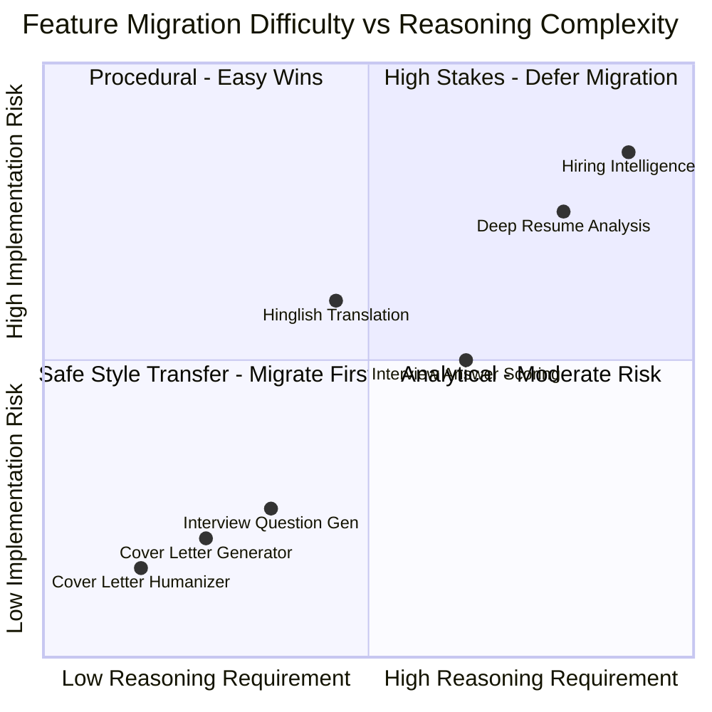

# 01 — Plain-English Conceptual Guide
### *Part A of the Kareerist Self-Hosted AI Models Blueprint*
**Audience:** Engineering Onboarding, Product Managers, and Technical Team

---

## A1. What You Are Actually Trying To Do

Right now, Kareerist operates like a restaurant without an internal kitchen: when a candidate submits a resume, the backend sends an API request to a proprietary provider (OpenAI, Anthropic, or Google), pays per token, and waits for a response formatted to prompt instructions. You pay per plate, you are at the mercy of upstream rate limits, and third-party deprecations dictate your product roadmap.

The proposal is to build your own kitchen: a language model that runs on dedicated GPU hardware you rent, trained specifically to execute Kareerist's seven career intelligence jobs and nothing else. You stop paying per token. You start paying fixed infrastructure rent.

Three foundational principles to internalize:
1. **You are not training a model from scratch:** Nobody outside of major hyperscalers pre-trains foundational models. Training from raw internet text costs $5M to $500M in compute, requires tens of thousands of cluster GPUs, and demands an army of research scientists. That is off the table permanently.
2. **You are specializing a pre-built brain:** Open-weight foundation models—such as Qwen, Llama, and Mistral—are released freely with their numerical parameters (the "weights") available for download. They already possess fluent English, Hindi, Python, and an understanding of tech resumes. What they lack is Kareerist's calibrated recruiter voice, specific JSON output shapes, and Hinglish code-switching register. Conditioning those habits is called **instruction fine-tuning**, and it costs tens of dollars on rented hardware, not millions.
3. **Fine-tuning alters behavior and tone, NOT reasoning ability:** Fine-tuning is like onboarding a competent new hire on your company’s internal review rubrics and house style. It is not like making them smarter. If an 8B foundation model cannot reason about a candidate pivoting from mechanical engineering into MLOps, no amount of fine-tuning will grant it that intelligence. It will simply emit an ungrounded hallucination wrapped in syntactically flawless JSON.

---

## A2. The Vocabulary Defined in Plain Terms

| Term | Practical Definition |
| :--- | :--- |
| **Parameters (7B, 14B)** | The total count of floating-point numbers defining the model's neural network. 7B = 7 billion parameters. Larger models exhibit deeper reasoning but require more VRAM and run slower. |
| **Weights** | The binary files containing these billions of numerical values. A 7B model in 16-bit precision requires ~15 GB of disk and memory. |
| **Open-Weight Model** | A model whose trained weights are publicly downloadable (subject to licensing terms), contrasting with closed APIs. |
| **Base vs. Instruct** | A *Base* model continues raw text strings; an *Instruct* model has already been tuned to engage in multi-turn dialogues and follow instructions. We always fine-tune on top of Instruct checkpoints. |
| **Inference** | Forward execution of the neural network to generate tokens from an input prompt. |
| **SFT (Supervised Fine-Tuning)** | Presenting paired input-output examples until the model reliably reproduces the target output style and structure. |
| **LoRA (Low-Rank Adaptation)** | Freezing the billions of foundation weights and training lightweight adapter matrices (~40M to 150M parameters) injected into attention and MLP layers. Reduces memory requirements by up to 80%. |
| **QLoRA** | Quantized LoRA: compressing the frozen base weights to 4-bit NormalFloat while computing gradients through full-precision adapters. Enables training 14B models on consumer GPUs. |
| **Quantization (AWQ, FP8, GGUF)** | Compressing model weights into lower-precision representations (e.g., 4-bit or 8-bit) to minimize memory footprint and boost inference bandwidth. |
| **Distillation** | Generating synthetic gold-standard outputs using a large, high-capacity model (e.g., DeepSeek-V3 or Claude 3.5 Sonnet) and training a smaller student model to match them. |
| **Synthetic Data** | Training examples programmatically generated by AI models rather than collected from real human users. |
| **Tokens** | Chunks of characters processed by models. In English, 1 token ≈ 0.75 words. A standard 1-page resume is approximately 600–900 tokens. |
| **Context Window** | The maximum token limit a model can read and write in a single session. If input + output exceeds this limit, text is silently truncated. |
| **VRAM** | Video RAM on the GPU. The model weights, activations, and conversation scratchpads must reside here. This is the primary hardware bottleneck. |
| **vLLM** | High-throughput inference engine utilizing PagedAttention and continuous batching for serving open-weight models with an OpenAI-compatible HTTP API. |
| **Continuous Batching** | vLLM's mechanism of interleaving multiple concurrent requests token-by-token rather than waiting for an entire generation to finish before starting the next. |
| **Constrained Decoding** | Restricting token sampling at runtime using context-free grammars or JSON Schema validators, mathematically guaranteeing 100% syntactically valid JSON output without fine-tuning. |
| **Catastrophic Forgetting** | The tendency of neural networks to lose general reasoning and conversational ability when fine-tuned excessively on narrow, homogeneous datasets. |
| **Epoch** | One complete training pass through the entire training dataset. |
| **LoRA Rank ($r$)** | The dimensionality of the adapter matrices. $r=16$ represents a light touch; $r=48$ to $64$ provides capacity for multi-task personas and linguistic code-switching. |
| **Cold Start** | The latency delay on serverless GPU hosting while a 10GB–15GB model container is loaded into GPU memory from network storage (often 30–90 seconds). |
| **LLM-as-Judge** | Using an independent high-capacity model to score student model outputs against an anchored rubric across held-out benchmarks. |

---

## A3. The Seven Jobs and an Honest Difficulty Rating

The original blueprint assumed all seven Kareerist features were equally straightforward to fine-tune. They are not. Tasks requiring pure style transfer are trivial for a 7B model, while multi-document comparative reasoning represents the ceiling of small model capabilities.



| # | Task Feature | Input Context | Target Output | SLM Feasibility | Recommended Migration Verdict |
| :--- | :--- | :--- | :--- | :--- | :--- |
| **1** | **Cover Letter Humanizer** | AI/Robotic Draft | Conversational Plaintext | **Very Low** | **Migrate First (Week 10)**. Pure style transfer; immediate win. |
| **2** | **Cover Letter Generator** | Resume + Job Description | ~200-word Narrative | **Low** | **Migrate Early (Week 11)**. Persona and concise length adapt quickly. |
| **3** | **Mock Interview Questions** | Role + Seniority + Resume | 6 Structured Qs | **Low** | **Migrate Early (Week 11)**. Pattern-matching and templated variation. |
| **4** | **Interview Answer Scoring** | Question + Candidate Answer | Rubric 0-10 + Feedback | **Medium** | **Migrate Mid-Stage (Week 12)**. Requires explicit rubric anchoring to prevent score jitter. |
| **5** | **Hinglish Translator** | English Career Feedback | Colloquial Roman Hinglish | **Medium (Data Bottleneck)** | **Migrate Mid-Stage (Week 12)**. Requires human-curated training data, not synthetic distillation. Serve as a separate LoRA. |
| **6** | **Deep Resume Analysis** | Full Resume + JD | Multi-section JSON + Quoted Issues | **High** | **Migrate Late (Week 13)**. Must be deconstructed into 6 parallel section calls to avoid context overflow and latency bottlenecks. |
| **7** | **Hiring Intelligence** | Resume + JD + Market Intel | Skill Gaps + Readiness Rating | **Very High** | **Keep on Frontier API / Defer**. Heavy comparative reasoning with legal/advisory exposure. |

---

## A4. How Fine-Tuning Actually Works, Step-by-Step

Imagine a spreadsheet with two columns and 9,000 rows:
* **Column A (Prompt):** The system instructions, context, candidate resume, and target role.
* **Column B (Ideal Completion):** The perfect recruiter critique in calibrated tone and structured JSON.

```
Row 1:
  Column A: "You are a brutally honest tech recruiter. Audit this resume: [Resume Text]"
  Column B: "{\"summary\": \"3 years backend, but zero quantified metrics...\", ...}"

Row 2:
  Column A: "You are a brutally honest tech recruiter. Audit this resume: [Different Resume]"
  Column B: "{\"summary\": \"Strong systems depth, weak communication signals...\", ...}"
```

Training operates in an iterative loop:
1. The model ingests Column A and predicts the first token of Column B.
2. The prediction is compared against the actual target token in Column B.
3. A cross-entropy loss calculation penalizes the model for any discrepancy.
4. Backpropagation calculates the mathematical gradient of the loss with respect to the LoRA adapter parameters.
5. The optimizer (e.g. AdamW 8-bit) nudges the adapter weights slightly to reduce error on subsequent predictions.
6. This cycle repeats across all 9,000 examples over 2 complete passes (epochs).

### Two Essential Realities of Fine-Tuning:
* **The model learns the teacher's flaws:** If the teacher model was overly lenient on 10% of training resumes, your student model will faithfully learn to be lenient 10% of the time. You cannot fix bad training labels with prompt tweaks; you must clean the data and retrain.
* **Loss masking is mandatory:** By default, standard training code computes loss across both Column A and Column B. This wastes over 60% of GPU compute teaching the model how to write tech resumes instead of analyzing them. Using `train_on_responses_only` restricts gradient updates strictly to Column B.

---

## A5. Where the Training Data Actually Comes From

You do not need to wait for thousands of real candidates to upload resumes. Instead, you build a synthetic data pipeline:

1. **Seed Specs:** Define a structured `CandidateSpec` matrix spanning seniority (0–15 years), tech domains (Backend, Frontend, ML, DevOps, QA), university tiers, and deliberate resume defects (missing metrics, wall-of-text, buzzword soup, unexplained career gaps).
2. **Synthetic Resume Synthesis:** Generate full-length resumes from the specs and compile them into realistic PDF documents.
3. **Extraction Simulation:** Run the generated PDFs through Kareerist's production extraction parser (PyMuPDF / OCR). This injects authentic formatting noise, table-mangling, and spacing artifacts into the input text.
4. **Teacher Distillation:** Feed extracted resumes to a permissively-licensed teacher model (e.g. DeepSeek-V3 or Qwen2.5-72B) accompanied by production system prompts.
5. **Quality Gauntlet:** Filter the output through automated schema validation, entity-grounding checks (verifying quoted text exists verbatim in the resume), score-band balancing, and MinHash deduplication.
6. **Human Spot-Check:** Personally read 200 random training records before kicking off a training job. The quality of your model is bounded entirely by the quality of this dataset.

---

## A6. How the Model Gets Served

Once trained, model weights are hosted on a dedicated GPU server using **vLLM**:
* **PagedAttention:** Traditional inference allocates contiguous memory for conversation scratchpads (KV cache), wasting up to 60–80% of VRAM through fragmentation. PagedAttention allocates memory in small, non-contiguous pages like an operating system allocates virtual RAM, enabling up to 5x greater user concurrency.
* **Continuous Batching:** Instead of processing one user's generation to completion before beginning the next, vLLM dynamically interleaves requests token-by-token. Short queries are never stalled behind lengthy resume reviews.
* **Constrained Decoding:** vLLM natively integrates schema validators (via Outlines / XGrammar). By masking invalid tokens during sampling, malformed JSON outputs become mathematically impossible at runtime.

---

## A7. What This Actually Costs, Honestly

Self-hosting replaces variable, pay-per-token API bills with fixed infrastructure expenses and permanent maintenance overhead:

* **Data Generation:** $120–$250 via DeepSeek-V3 Batch API (down from $1,500+ with proprietary frontier models).
* **Human Annotation (Hinglish):** $400–$800 to hire 2–3 native tech speakers for 800 authentic samples.
* **Training Compute:** $150–$350 across 8–12 iterative tuning runs on rented A100-80GB GPUs.
* **Dedicated Production Serving:** $500–$900/month for redundant GPU instances (2x NVIDIA L4).
* **Engineering Overhead:** 150–350 engineering hours up-front, plus 10–20 hours/month ongoing for observability, monitoring, retraining, and incident response.

**The Economic Truth:** Self-hosting does not automatically save money. Below ~400–600 DAU, commercial APIs paired with prompt caching and structured outputs are cheaper and carry zero maintenance burden. Self-hosting becomes financially superior only above that threshold.
