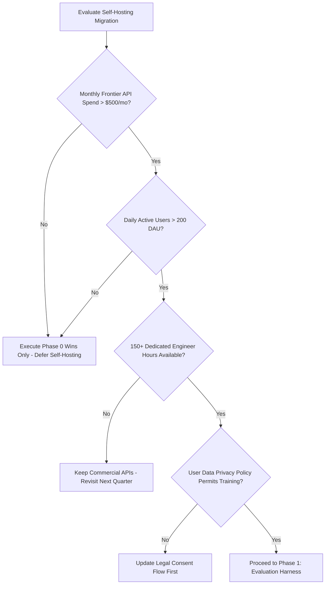
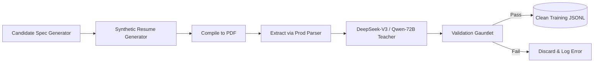
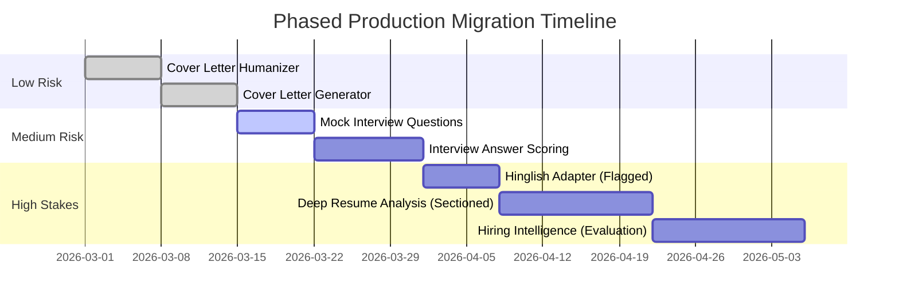

# 03 — The Corrected Blueprint (v2.0)
### *Part C of the Kareerist Self-Hosted AI Models Blueprint*
**Audience:** Lead ML Engineers, Backend Platform Engineers, and DevOps

---

## C0. Restated Objective

> Build **Kareerist-Core**, a self-hosted inference cluster running open-weight models that handles **90–95% of routine career workflows** at predictable cost and lower latency, while preserving our direct, calibrated recruiter persona. Maintain a **permanent commercial frontier API fallback** for outages, complex edge cases, and high-stakes reasoning.

Trained exclusively on data distilled from permissively-licensed teachers (DeepSeek-V3 MIT, Qwen Apache 2.0) to ensure full IP ownership and compliance.

---

## C1. Decision Gate — Should You Even Do This Yet?



| Evaluation Question | Metric Threshold | Action if Threshold Is Not Met |
| :--- | :--- | :--- |
| **Monthly Commercial API Spend?** | $> \$500/\text{month}$ | Defer. You are optimizing a negligible financial variance. |
| **Daily Active Users (DAU)?** | $> 200\text{ DAU}$ | Defer. Implement Phase 0 optimizations only. |
| **Core Product-Market Fit Validated?** | Confirmed Retention | Do not initiate. Building models during rapid pivot cycles is waste. |
| **Engineering Bandwidth Available?** | $150+\text{ Hours}$ | Keep commercial APIs. Half-finished models deliver negative value. |
| **Privacy Policy Consent for Training?** | Express User Opt-In | Update terms and consent flows first. Regulatory risk gates data use. |

---

## C2. Phase 0 — Free and Near-Free Wins (Week 1)

Execute these zero-GPU optimizations directly on the existing stack before training any model:

1. **Strict Structured Outputs:** Enable native JSON Schema mode on existing commercial APIs, eliminating 100% of JSON syntax errors immediately.
2. **Prompt Caching:** Restructure prompts to keep the system instructions and rubrics byte-identical across requests, reducing input token billing by 50–70%.
3. **Deconstruct Deep Resume Analysis:** Refactor the single monolithic analysis call into 6 parallel sub-requests (`contact`, `summary`, `experience`, `skills`, `education`, `verdict`). Improves wall-clock response time by ~3.5x.
4. **End-to-End SSE Streaming:** Implement Server-Sent Events from backend to frontend, rendering feedback sections progressively.
5. **Tiered Model Routing:** Route low-complexity tasks (Humanizer, Cover Letter) to fast, lightweight models, reserving frontier models exclusively for Deep Analysis and Hiring Intelligence.
6. **Deploy Circuit Breaker:** Wrap the LLM client in an automated fallback mechanism, eliminating user-visible outages caused by upstream provider downtime.

---

## C3. Phase 1 — Evaluation Harness First (Week 2)

Before writing a single training record, build the automated evaluation suite:

```
eval/
├── golden/
│   ├── normal/        # 30 standard representative resumes across domains
│   ├── edge/          # 15 challenging resumes (gaps, missing metrics, non-tech)
│   └── adversarial/   # 5 prompt-injection and delimiter-breaking test files
├── ranked/            # 20 resumes sorted manually best-to-worst for Spearman ranking
├── rubrics/           # Ground-truth evaluation rubrics (1-5 scales)
├── run_eval.py        # Automated test harness emitting unified Scorecard
└── baseline.json      # Frozen benchmark metrics from current production API
```

#### Objective Acceptance Gates for Deployment
* **Schema Validation:** 100.0% valid Pydantic parsing.
* **Entity Hallucination Rate:** < 2.0% of quoted snippets absent from input text.
* **Score Discrimination:** Spearman rank correlation $\rho \ge 0.65$ against hand-ranked resumes.
* **Score Stability:** Standard deviation $\sigma \le 4.0$ points across 3 identical runs at temperature 0.
* **Hinglish Quality:** 0.0% Devanagari script leakage; naturalness rating $\ge 3.8 / 5.0$ by native speakers.
* **Pairwise Win-Rate:** $\ge 45.0\%$ win/tie rate in blind evaluations against current commercial API outputs.

---

## C4. Phase 2 — Base Model Bake-Off Protocol (Week 2)

Benchmark four candidate base models across 50 standardized test resumes using zero-shot guided decoding:
* `Qwen/Qwen2.5-7B-Instruct` (Apache 2.0)
* `Qwen/Qwen2.5-14B-Instruct` (Apache 2.0)
* `google/gemma-2-9b-it` (Gemma Terms)
* `mistralai/Ministral-8B-Instruct-2410` (Mistral Commercial)

**Evaluation Strategy:** Run each zero-shot with production prompts + guided JSON on identical inputs. Score with the evaluation harness. Select the 14B model if AWQ quantization fits the serving VRAM budget, or 7B if strict low-latency takes precedence.

---

## C5. Phase 3 — The Data Engine (Weeks 3–5)



### 1. Seed Generation via Structured Specs
```python
class CandidateSpec(BaseModel):
    years_experience: int
    domain: Literal["backend", "frontend", "data", "ml", "devops", "qa", "product", "pivot"]
    seniority: Literal["intern", "junior", "mid", "senior", "lead", "staff"]
    college_tier: Literal["tier1", "tier2", "tier3", "bootcamp", "self_taught"]
    overall_quality: Literal["disastrous", "poor", "mediocre", "strong", "exceptional"]
    deliberate_defects: List[str]  # e.g., ["unquantified_bullets", "buzzword_stuffing", "2yr_unexplained_gap"]
    target_role: str
```

### 2. PDF Extraction Realism Simulation
Compile synthetic resumes to PDF format, then run them through your production PDF extraction pipeline (PyMuPDF / OCR). This forces training inputs to contain the authentic spacing glitches, broken tabular text, and ligature quirks present in production.

### 3. The Dataset Scaling Ladder
```
Rung 1:  1,500 samples  --> Smoke test pipeline & training scripts
Rung 2:  4,000 samples  --> Measure format adherence & initial tone
Rung 3:  9,000 samples  --> Evaluate schema calibration & score stability
Rung 4: 18,000 samples  --> Execute only if Rung 3 demonstrates active gains
```

#### Target Composition for Rung 3 (9,000 Samples)
* **Deep Resume Analysis (Sectioned):** 3,000 samples (500 per section x 6)
* **Hiring Intelligence:** 1,500 samples
* **Interview Question Generation:** 800 samples
* **Interview Answer Scoring:** 1,600 samples
* **Cover Letter Generator:** 600 samples
* **Cover Letter Humanizer:** 500 samples
* **General Instruction Preservation:** 700 samples (OpenHermes/Tulu)
* **Adversarial / Injection Defense:** 300 samples
* **Hinglish Register (Separate Adapter):** 800 human-curated samples

---

## C6. Phase 4 — Production Training Pipeline (Weeks 6–7)

### Multi-LoRA Serving Architecture
```
┌────────────────────────────────────────────────────────┐
│            Base Model: Qwen2.5-14B-AWQ (Frozen)        │
└───────────────────────────┬────────────────────────────┘
                            │
            ┌───────────────┴───────────────┐
            ▼                               ▼
┌──────────────────────────────┐┌──────────────────────────────┐
│  Adapter A: "core-english"   ││  Adapter B: "hinglish"       │
│  - Rank: 48, Alpha: 48       ││  - Rank: 32, Alpha: 32       │
│  - 6 Structured Tasks        ││  - Spoken Tech Dialect       │
│  - ~8,300 Samples            ││  - 800 Human-Curated Samples │
└──────────────────────────────┘└──────────────────────────────┘
```

### Corrected Training Script: `train_kareerist.py`
```python
"""
train_kareerist.py - Production QLoRA Fine-Tuning Pipeline
Corrects context truncation, chat templates, loss masking, and experiment logging.
"""

import json
import hashlib
import torch
from datasets import load_dataset
from trl import SFTTrainer, SFTConfig
from unsloth import FastLanguageModel
from unsloth.chat_templates import train_on_responses_only

# 1. Configuration & Context Enforcement
MAX_SEQ_LENGTH = 8192
BASE_MODEL_NAME = "unsloth/Qwen2.5-14B-Instruct-bnb-4bit"
DATASET_PATH = "data/kareerist_core_9k.jsonl"
OUTPUT_DIR = "./runs/kareerist_core_v2"

# 2. Initialize Model & Fast Tokenizer
model, tokenizer = FastLanguageModel.from_pretrained(
    model_name=BASE_MODEL_NAME,
    max_seq_length=MAX_SEQ_LENGTH,
    dtype=None,  # Auto-detect bfloat16
    load_in_4bit=True,
)

# 3. Configure Parameter-Efficient LoRA Adapters
model = FastLanguageModel.get_peft_model(
    model,
    r=48,
    lora_alpha=48,
    lora_dropout=0.05,
    target_modules=[
        "q_proj", "k_proj", "v_proj", "o_proj",
        "gate_proj", "up_proj", "down_proj"
    ],
    bias="none",
    use_gradient_checkpointing="unsloth",
    random_state=3407,
)

# 4. Standardized ChatML Formatting
def apply_template(record):
    messages = [
        {"role": "system", "content": record["system"]},
        {"role": "user", "content": record["user"]},
        {"role": "assistant", "content": record["assistant"]},
    ]
    # add_generation_prompt=False ensures proper <|im_end|> EOS token inclusion
    formatted_text = tokenizer.apply_chat_template(
        messages, tokenize=False, add_generation_prompt=False
    )
    return {"text": formatted_text}

raw_dataset = load_dataset("json", data_files=DATASET_PATH, split="train")
formatted_dataset = raw_dataset.map(apply_template)

# 5. Enforce Hard Assertion Against Token Truncation
tokenized_lengths = [
    len(tokenizer(row["text"]).input_ids) for row in formatted_dataset
]
max_observed_len = max(tokenized_lengths)
print(f"Dataset token stats: Max={max_observed_len}, p95={sorted(tokenized_lengths)[int(len(tokenized_lengths)*0.95)]}")

if max_observed_len > MAX_SEQ_LENGTH:
    raise ValueError(
        f"ABORT: Observed token length ({max_observed_len}) exceeds MAX_SEQ_LENGTH ({MAX_SEQ_LENGTH}). "
        "Truncation will train incomplete JSON outputs. Increase MAX_SEQ_LENGTH or split tasks."
    )

# 6. Trainer Configuration
training_args = SFTConfig(
    dataset_text_field="text",
    max_seq_length=MAX_SEQ_LENGTH,
    per_device_train_batch_size=1,        # Prevents OOM at 8192 context
    gradient_accumulation_steps=16,       # Effective batch size = 16
    num_train_epochs=2,
    warmup_ratio=0.05,
    learning_rate=1e-4,                   # Stable learning rate for calibrated scoring
    lr_scheduler_type="cosine",
    optim="adamw_8bit",
    weight_decay=0.01,
    bf16=torch.cuda.is_bf16_supported(),
    fp16=not torch.cuda.is_bf16_supported(),
    logging_steps=10,
    save_steps=200,
    seed=3407,
    output_dir=OUTPUT_DIR,
    report_to="wandb",
)

trainer = SFTTrainer(
    model=model,
    tokenizer=tokenizer,
    train_dataset=formatted_dataset,
    args=training_args,
)

# 7. Apply Response Masking (CRITICAL)
# Restricts gradient calculation strictly to assistant completion tokens
trainer = train_on_responses_only(
    trainer,
    instruction_part="<|im_start|>user\n",
    response_part="<|im_start|>assistant\n",
)

# 8. Train & Export Checkpoints
trainer.train()

# Export full 16-bit reference weights and standalone LoRA adapter
model.save_pretrained_merged("artifacts/kareerist-core-v2-bf16", tokenizer, save_method="merged_16bit")
model.save_pretrained("artifacts/kareerist-core-v2-lora")

# Save run metadata manifest
with open(f"{OUTPUT_DIR}/manifest.json", "w") as f:
    json.dump({
        "base_model": BASE_MODEL_NAME,
        "dataset_hash": hashlib.sha256(open(DATASET_PATH, "rb").read()).hexdigest(),
        "max_seq_length": MAX_SEQ_LENGTH,
        "lora_rank": 48,
        "lora_alpha": 48,
        "epochs": 2,
        "learning_rate": 1e-4,
    }, f, indent=2)
```

---

## C7. Phase 5 — Production Serving & Fallback Client (Weeks 8–9)

### vLLM Serving Daemon Script
```bash
#!/usr/bin/env bash
set -euo pipefail

python -m vllm.entrypoints.openai.api_server \
    --model ./artifacts/kareerist-core-v2-awq \
    --served-model-name kareerist-core \
    --quantization awq \
    --enable-lora \
    --lora-modules hinglish=./artifacts/kareerist-hinglish-v1-lora \
    --max-lora-rank 48 \
    --max-model-len 8192 \
    --gpu-memory-utilization 0.90 \
    --max-num-seqs 24 \
    --enable-prefix-caching \
    --port 8000 \
    --api-key "${VLLM_INTERNAL_API_KEY}"
```

### Production Backend Client: `llm_client.py`
```python
"""
backend/app/services/llm_client.py
Asynchronous client with circuit breaker, schema enforcement, and zero-downtime fallback.
"""

import os
import time
import asyncio
import logging
from typing import Optional, Dict, Any, AsyncGenerator
from openai import AsyncOpenAI

logger = logging.getLogger(__name__)

# Primary and Fallback Clients
_self_hosted_client = AsyncOpenAI(
    base_url=os.getenv("VLLM_BASE_URL", "http://localhost:8000/v1"),
    api_key=os.getenv("VLLM_INTERNAL_API_KEY", "internal-cluster-key"),
)

_fallback_client = AsyncOpenAI(
    api_key=os.getenv("FRONTIER_API_KEY"),
)

class CircuitBreaker:
    def __init__(self, failure_threshold: int = 3, recovery_cooldown_sec: float = 60.0):
        self.failure_threshold = failure_threshold
        self.recovery_cooldown_sec = recovery_cooldown_sec
        self.failure_count = 0
        self.open_until_timestamp = 0.0

    @property
    def is_open(self) -> bool:
        return time.time() < self.open_until_timestamp

    def record_success(self):
        self.failure_count = 0

    def record_failure(self):
        self.failure_count += 1
        if self.failure_count >= self.failure_threshold:
            self.open_until_timestamp = time.time() + self.recovery_cooldown_sec
            logger.error(
                "CIRCUIT OPEN: Self-hosted cluster failing. Routing traffic to fallback for %.1fs",
                self.recovery_cooldown_sec
            )

circuit_breaker = CircuitBreaker()

# Granular Feature Routing Configuration
FEATURE_ROUTING: Dict[str, str] = {
    "cover_letter_humanizer": "self_hosted",
    "cover_letter_generator": "self_hosted",
    "interview_questions":    "self_hosted",
    "interview_scoring":      "shadow",       # Run both, return fallback, log diff
    "deep_resume_analysis":   "fallback",     # Migrate in Phase 6
    "hiring_intelligence":    "fallback",     # Retain on frontier API
    "hinglish_translation":   "self_hosted",
}

async def generate_career_intelligence(
    feature: str,
    messages: list,
    json_schema: Optional[Dict[str, Any]] = None,
    lora_adapter: Optional[str] = None,
    timeout_sec: float = 45.0,
) -> AsyncGenerator[str, None]:
    """
    Streaming generation router with circuit breaker protection and guided schema compliance.
    """
    routing_mode = FEATURE_ROUTING.get(feature, "fallback")
    target_model = lora_adapter if lora_adapter else "kareerist-core"

    # 1. Self-Hosted Execution Path
    if routing_mode == "self_hosted" and not circuit_breaker.is_open:
        try:
            extra_body = {}
            if json_schema:
                # Enforce schema determinism at sampling time
                extra_body["guided_json"] = json_schema

            response_stream = await _self_hosted_client.chat.completions.create(
                model=target_model,
                messages=messages,
                stream=True,
                extra_body=extra_body if extra_body else None,
                timeout=timeout_sec,
            )

            circuit_breaker.record_success()
            async for chunk in response_stream:
                content = chunk.choices[0].delta.content or ""
                if content:
                    yield content
            return

        except Exception as exc:
            logger.warning("Self-hosted execution failed for %s (%s). Engaging fallback.", feature, exc)
            circuit_breaker.record_failure()

    # 2. Shadow Evaluation Path (Silent Comparison)
    elif routing_mode == "shadow":
        asyncio.create_task(_execute_shadow_run(feature, messages, json_schema, target_model))

    # 3. Commercial Fallback Execution Path
    fallback_schema = (
        {"type": "json_schema", "json_schema": {"name": f"{feature}_schema", "schema": json_schema}}
        if json_schema else None
    )

    fallback_stream = await _fallback_client.chat.completions.create(
        model="gpt-4o-mini",
        messages=messages,
        response_format=fallback_schema,
        stream=True,
        timeout=timeout_sec,
    )

    async for chunk in fallback_stream:
        content = chunk.choices[0].delta.content or ""
        if content:
            yield content

async def _execute_shadow_run(feature: str, messages: list, schema: Optional[dict], model: str):
    """Executes local model out-of-band and persists completions for comparison."""
    try:
        res = await _self_hosted_client.chat.completions.create(
            model=model,
            messages=messages,
            stream=False,
            extra_body={"guided_json": schema} if schema else None,
            timeout=60.0,
        )
        logger.info("Shadow completion captured for %s [Length: %d]", feature, len(res.choices[0].message.content or ""))
    except Exception as exc:
        logger.debug("Shadow run failed for %s: %s", feature, exc)
```

### Production Telemetry & Monitoring Matrix

| Metric Name | Collection Source | Alert Threshold | Operational Implication |
| :--- | :--- | :--- | :--- |
| **p95 Latency by Feature** | API Gateway Middleware | $> 30.0\text{ seconds}$ | Concurrency saturation; scale GPU replicas. |
| **Circuit Breaker Status** | `llm_client.py` Logger | Trips $> 0$ | Local instance down; investigate crash or OOM. |
| **GPU VRAM Utilization** | Prometheus / DCGM Exporter | $> 92.0\%$ | KV cache nearing capacity; reduce `--max-num-seqs`. |
| **Queue Depth (`num_waiting`)** | vLLM Engine Metrics | $> 10\text{ requests}$ | Request queue stalled; throttle inbound traffic. |
| **Schema Parse Error Rate** | Pydantic Parser Layer | $> 0.0\%$ | Guided decoding bypass or corrupted response. |
| **Fallback Traffic Share** | Gateway Metrics | $> 15.0\%$ | Local cluster degraded or shedding load. |

---

## C8. Phase 6 — Staged Migration Sequence (Weeks 10–14)



### Governance Migration Rules
1. **Shadow Verification:** Every feature must run in shadow mode for a minimum of 1,000 real production requests.
2. **Canary Progression:** Traffic allocation progresses: 5% $\rightarrow$ 25% $\rightarrow$ 50% $\rightarrow$ 100%.
3. **Rollback Trigger:** An automated rollback to the frontier API triggers if user regeneration clicks increase by >15% or if p95 response latency exceeds 30 seconds.
4. **Hiring Intelligence Retained:** Hiring Intelligence remains routed to commercial frontier models until full multi-model audit certifications are completed.

---

## C9. Corrected Cost & Timeline Breakdown

#### Capital & Infrastructure Expenditure Comparison

| Expense Category | Original v1 Claim | Corrected v2 Reality | Variance Driver |
| :--- | :--- | :--- | :--- |
| **Synthetic Dataset Synthesis** | $90 – $130 | **$120 – $250** | DeepSeek-V3 Batch API with prompt caching. |
| **Human Hinglish Annotation** | $0 (Unbudgeted) | **$400 – $800** | Compensating 3 native engineers for 800 samples. |
| **Training GPU Compute** | $8 – $12 | **$150 – $350** | 8 to 12 iterative training runs on A100-80GB. |
| **Evaluation Judge Inference** | $0 (Unbudgeted) | **$50 – $120** | Automated scoring over golden test sets. |
| **Total One-Time R&D Cost** | **~$110** | **~$720 – $1,520** | **~7x - 13x adjustment** |
| **Monthly Dedicated Serving** | $120 – $140/mo | **$500 – $900/mo** | 2x NVIDIA L4 instances for high-availability redundancy. |
| **Monitoring & Telemetry** | $0 (Unbudgeted) | **$40 – $80/mo** | Managed metrics, logs, and tracing infrastructure. |
| **Permanent Fallback Reserve** | $0 (Eliminated) | **$50 – $200/mo** | 5% tail traffic routed to commercial frontier API. |
| **Total Ongoing Monthly Cost**| **~$130/mo** | **~$590 – $1,180/mo** | **~5x - 9x adjustment** |

#### Real Break-Even Analysis
$$\text{Break-Even Volume} = \frac{\$750}{\$0.025} = 30,000\text{ queries/month} \approx 500\text{ DAU}$$

```
Daily Active Users (DAU)  │ Financial Verdict
──────────────────────────┼──────────────────────────────────────────────────────────
< 200 DAU                 │ Self-hosting operates at a net loss. Execute Phase 0 only.
200 – 600 DAU             │ Parity zone. Justified by control, not cost savings.
> 600 DAU                 │ Substantial cost savings. Self-hosting strongly recommended.
```

#### Phased Delivery Schedule (14 Weeks Total)
```
Phase 0 — Zero-GPU Wins              : 1 Week    [Immediate 60-80% cost reduction]
Phase 1 — Evaluation Harness         : 1 Week    [Freeze baseline benchmarks]
Phase 2 — Base Model Bake-Off        : 2 Days    [Select optimal foundation SLM]
Phase 3 — Data Engine & Curation     : 3 Weeks   [Synthesis, validation, 800 Hinglish]
Phase 4 — QLoRA Training Ladder      : 2 Weeks   [1.5k -> 4k -> 9k scaling runs]
Phase 5 — vLLM Serving & Integration : 2 Weeks   [Hardening, circuit breaker, telemetry]
Phase 6 — Phased Canary Migration    : 5 Weeks   [Staged canary rollout with fallback]
```
